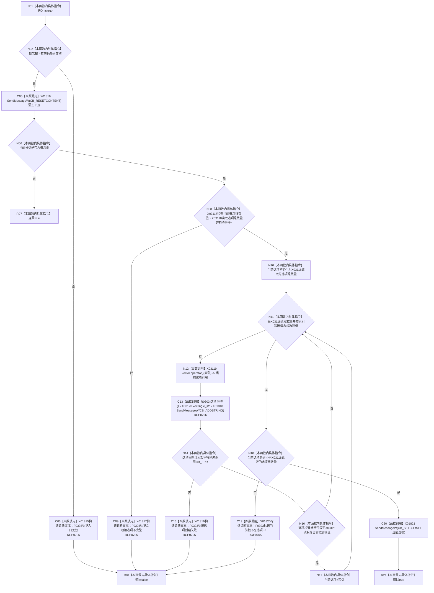

# CF-L8-0029 重建概念根下拉现状流程图

图类型：现状流程图
代码版本：`3920a74638264f9f539d50f32f3c9fe5fb1982ab`
源码 blob：`fe9dad1eb3728c823beccf305c783be96a3df33d`
覆盖文件：`海中鱼巣/界面/控制面板窗口.cpp:705-741`
唯一根函数：R0192
完整签名：`bool 海中鱼巣::控制面板窗口::窗口实现::重建概念根下拉()`
参数：无显式参数；读取概念根下拉句柄、当前分类、当前概念根与概念根选项组
返回结果：非概念树分类或完整重建并选中当前概念根时返回 `true`；入口、选项或当前根不一致时返回 `false`
已登记调用方：RCE0623、RCE0639、RCE0654、RCE0737
直接项目函数：RCE0705 → F0393；RCE0706 → R0303
外部边界：X01815—X01821、X03117—X03121；未解析项目调用：0
逐行映射表：`流程图/代码流程图/L8/CF-L8-0029_重建概念根下拉_逐行代码映射表.md`
依据：关系发布基线 `010784a906e8283644a63a742151f6457a847c38` 与冻结源码
结构读写：清空并重建 Windows 下拉列表；不写底层概念根事实
不得作为施工许可：是
不得宣称：下拉项完整证明概念根仓库结构完整

## 流程图

## 当前边界

- 714—715、719—721、727、731、735 行的 `optional`、`vector` 与 `wstring` 调用已冻结为 X03117—X03121。
- 下拉添加失败和当前根不在四个活动选项中均按内部结构异常返回假。
