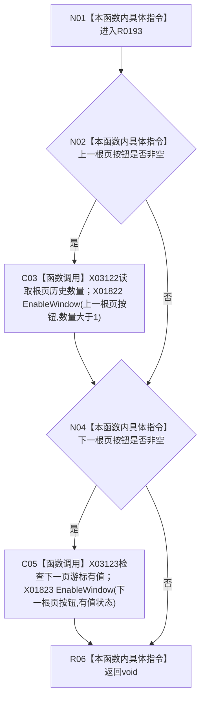

# CF-L8-0030 更新根页按钮状态现状流程图

图类型：现状流程图
代码版本：`3920a74638264f9f539d50f32f3c9fe5fb1982ab`
源码 blob：`fe9dad1eb3728c823beccf305c783be96a3df33d`
覆盖文件：`海中鱼巣/界面/控制面板窗口.cpp:743-752`
唯一根函数：R0193
完整签名：`void 海中鱼巣::控制面板窗口::窗口实现::更新根页按钮状态() const`
参数：无显式参数；读取前后页按钮、根页历史组与下一页游标
返回结果：`void`；对存在的按钮更新启用状态
已登记调用方：RCE0624、RCE0642、RCE0656、RCE0738
直接项目函数：无
外部边界：X01822、X01823、X03122、X03123；未解析项目调用：0
逐行映射表：`流程图/代码流程图/L8/CF-L8-0030_更新根页按钮状态_逐行代码映射表.md`
依据：关系发布基线 `010784a906e8283644a63a742151f6457a847c38` 与冻结源码
结构读写：只更新 Windows 按钮启用状态
不得作为施工许可：是
不得宣称：按钮状态证明根页历史或下一页材料是机器权威事实

## 流程图

## 当前边界

- 745 行 `vector::size()` 与 750 行 `optional::has_value()` 已冻结为 X03122、X03123。
- 控件指针为空时只跳过对应按钮，不形成错误返回。
