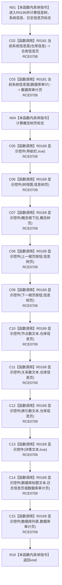

# CF-L8-0031 应用分页控件可见性现状流程图

图类型：现状流程图
代码版本：`3920a74638264f9f539d50f32f3c9fe5fb1982ab`
源码 blob：`fe9dad1eb3728c823beccf305c783be96a3df33d`
覆盖文件：`海中鱼巣/界面/控制面板窗口.cpp:765-783`
唯一根函数：R0195
完整签名：`void 海中鱼巣::控制面板窗口::窗口实现::应用分页控件可见性() const`
参数：无显式参数；读取当前分页、当前系统信息项和当前树分类
返回结果：`void`；按分页语境调用显示控件更新十一项控件
已登记调用方：RCE0630、RCE0635、RCE0643、RCE0660、RCE0724、RCE0739
直接项目函数：RCE0708 → R0181；RCE0709 → R0169
外部边界：无；未解析项目调用：0
逐行映射表：`流程图/代码流程图/L8/CF-L8-0031_应用分页控件可见性_逐行代码映射表.md`
依据：关系发布基线 `010784a906e8283644a63a742151f6457a847c38` 与冻结源码
结构读写：只更新窗口控件显示状态
不得作为施工许可：是
不得宣称：可见性状态会改变当前分页或底层仓库事实

## 流程图

## 当前边界

- 所有项目调用均只读取分页语境或写界面显示状态。
- `RCE0709` 聚合十一处同一被调函数调用，图中按真实调用次数逐项展开。
