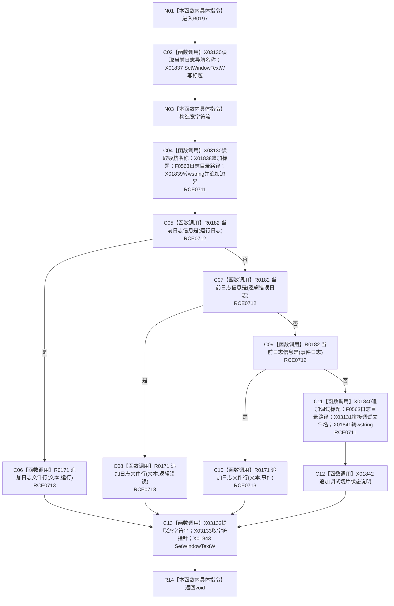

# CF-L8-0032 更新日志页现状流程图

图类型：现状流程图
代码版本：`3920a74638264f9f539d50f32f3c9fe5fb1982ab`
源码 blob：`fe9dad1eb3728c823beccf305c783be96a3df33d`
覆盖文件：`海中鱼巣/界面/控制面板窗口.cpp:861-887`
唯一根函数：R0197
完整签名：`void 海中鱼巣::控制面板窗口::窗口实现::更新日志页() const`
参数：无显式参数；读取当前日志导航索引和日志类别
返回结果：`void`；更新日志标题并把日志说明或选定日志行写入详情控件
已登记调用方：RCE0718、RCE0741
直接项目函数：RCE0711 → F0563；RCE0712 → R0182；RCE0713 → R0171
外部边界：X01837—X01843、X03130—X03133；未解析项目调用：0
逐行映射表：`流程图/代码流程图/L8/CF-L8-0032_更新日志页_逐行代码映射表.md`
依据：关系发布基线 `010784a906e8283644a63a742151f6457a847c38` 与冻结源码
结构读写：只读取日志材料并更新 Windows 文本控件
不得作为施工许可：是
不得宣称：日志内容是机器事实或可恢复运行期结构

## 流程图

## 当前边界

- 862、864、880、886 行的数组、路径和流字符串调用已冻结为 X03130—X03133。
- 日志类别分支只决定读取哪类人读材料，不改变权威仓库。
