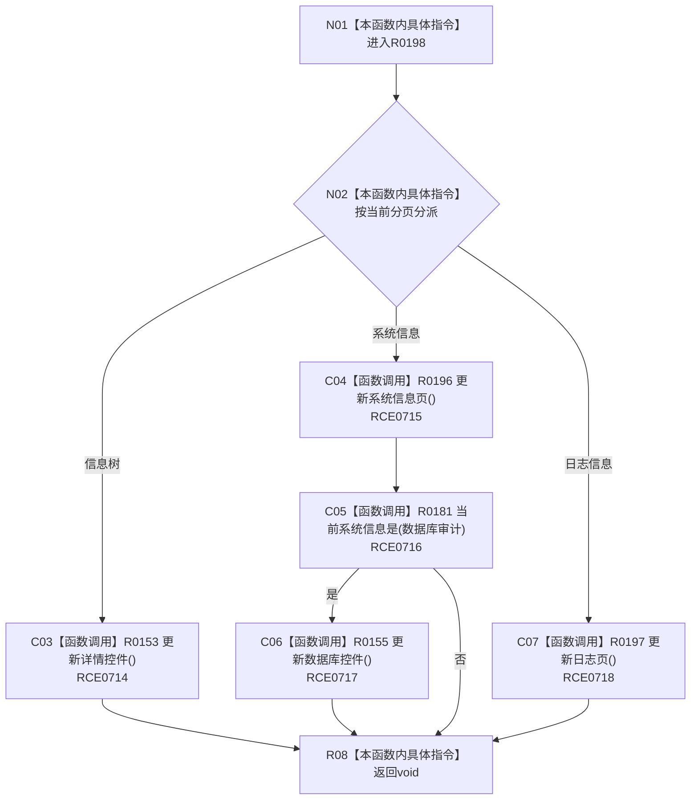

# CF-L8-0033 更新当前分页内容现状流程图

图类型：现状流程图
代码版本：`3920a74638264f9f539d50f32f3c9fe5fb1982ab`
源码 blob：`fe9dad1eb3728c823beccf305c783be96a3df33d`
覆盖文件：`海中鱼巣/界面/控制面板窗口.cpp:889-904`
唯一根函数：R0198
完整签名：`void 海中鱼巣::控制面板窗口::窗口实现::更新当前分页内容() const`
参数：无显式参数；读取当前分页与当前系统信息导航
返回结果：`void`；按分页更新详情、系统信息 / 数据库或日志内容
已登记调用方：RCE0628、RCE0659、RCE0725、RCE0742
直接项目函数：RCE0714 → R0153；RCE0715 → R0196；RCE0716 → R0181；RCE0717 → R0155；RCE0718 → R0197
外部边界：无；未解析项目调用：0
逐行映射表：`流程图/代码流程图/L8/CF-L8-0033_更新当前分页内容_逐行代码映射表.md`
依据：关系发布基线 `010784a906e8283644a63a742151f6457a847c38` 与冻结源码
结构读写：按当前分页调度界面内容刷新
不得作为施工许可：是
不得宣称：分页内容刷新会写入底层仓库

## 流程图

## 当前边界

- `switch` 仅覆盖当前枚举的三个分页值，无 `default` 分支。
- 数据库控件只在系统信息分页且当前导航为数据库审计时刷新。
