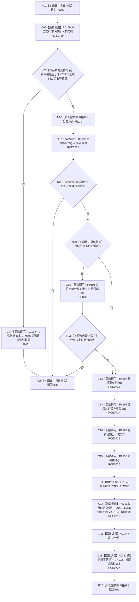

# CF-L8-0034 切换分页现状流程图

图类型：现状流程图
代码版本：`3920a74638264f9f539d50f32f3c9fe5fb1982ab`
源码 blob：`fe9dad1eb3728c823beccf305c783be96a3df33d`
覆盖文件：`海中鱼巣/界面/控制面板窗口.cpp:906-927`
唯一根函数：R0199
完整签名：`bool 海中鱼巣::控制面板窗口::窗口实现::切换分页(控制面板分页 新分页)`
参数：`新分页`，值传入的目标分页枚举
返回结果：分页索引越界、导航栏重建失败或信息树根定位失败时返回 `false`；其余界面刷新完成后返回 `true`
已登记调用方：RCE0667、RCE0730
直接项目函数：RCE0719 → R0159；RCE0720 → F0393；RCE0721 → R0183；RCE0722 → R0191；RCE0723 → R0194；RCE0724 → R0195；RCE0725 → R0198；RCE0726 → R0156；RCE0727 → R0167
外部边界：X01844—X01847、X03134—X03136；未解析项目调用：0
逐行映射表：`流程图/代码流程图/L8/CF-L8-0034_切换分页_逐行代码映射表.md`
依据：关系发布基线 `010784a906e8283644a63a742151f6457a847c38` 与冻结源码
结构读写：写当前分页并刷新导航、菜单、控件、内容、布局和状态栏
不得作为施工许可：是
不得宣称：分页切换会改变底层节点、关系或索引事实

## 流程图

## 当前边界

- 907、923、925 行的分页名称数组与状态字符串调用已冻结为 X03134—X03136。
- 当前分页在导航栏重建前即写入；后续失败不会在本函数回滚该字段。
