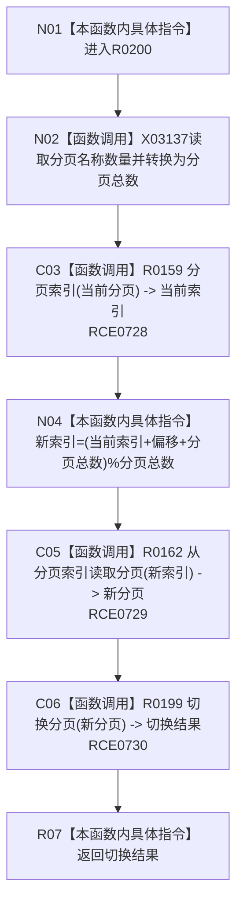

# CF-L8-0035 切换相邻分页现状流程图

图类型：现状流程图
代码版本：`3920a74638264f9f539d50f32f3c9fe5fb1982ab`
源码 blob：`fe9dad1eb3728c823beccf305c783be96a3df33d`
覆盖文件：`海中鱼巣/界面/控制面板窗口.cpp:929-934`
唯一根函数：R0200
完整签名：`bool 海中鱼巣::控制面板窗口::窗口实现::切换相邻分页(int 偏移)`
参数：`偏移`，值传入的有符号分页偏移量
返回结果：返回 R0199 对环绕计算所得分页的切换结果
已登记调用方：RCE0668
直接项目函数：RCE0728 → R0159；RCE0729 → R0162；RCE0730 → R0199
外部边界：X03137；未解析项目调用：0
逐行映射表：`流程图/代码流程图/L8/CF-L8-0035_切换相邻分页_逐行代码映射表.md`
依据：关系发布基线 `010784a906e8283644a63a742151f6457a847c38` 与冻结源码
结构读写：本函数只计算目标分页；实际分页与界面写入由 R0199 完成
不得作为施工许可：是
不得宣称：偏移计算本身证明分页切换成功

## 流程图

## 当前边界

- 930 行分页名称 `size()` 已冻结为 X03137。
- 当前代码通过先加一次分页总数处理常见负偏移；未单独限制偏移绝对值。
