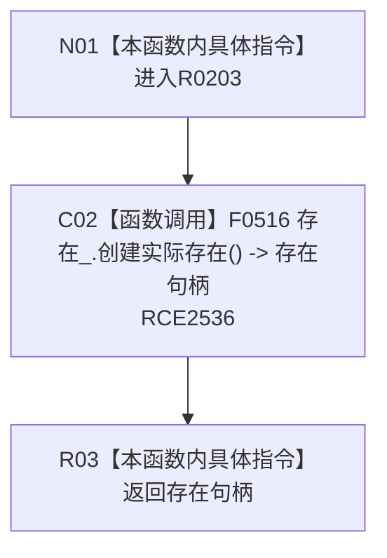

# CF-L8-0036 世界服务创建存在现状流程图

图类型：现状流程图
代码版本：`0a93526882cb33c61c2fbb04ecad1aeaddcfe225`
源码 blob：`75494ac696f3fbe3223bb966dab6dee39e4c5409`
覆盖文件：`海中鱼巣/领域/世界服务.h:28-30`
唯一根函数：R0203
完整签名：`节点句柄 海中鱼巣::世界服务::创建存在()`
参数：无显式参数；使用成员 `存在_`
返回结果：原样返回 `存在_.创建实际存在()` 的节点句柄
已登记调用方：RCE0289
直接项目函数：RCE2536 → F0516
外部边界：无；未解析项目调用：0
逐行映射表：`流程图/代码流程图/L8/CF-L8-0036_世界服务创建存在_逐行代码映射表.md`
依据：关系发布基线 `010784a906e8283644a63a742151f6457a847c38` 与冻结源码
结构读写：本函数只转发调用；实际结构变化由 F0516 决定
不得作为施工许可：是
不得宣称：世界服务包装调用必然创建成功

## 流程图

## 当前边界

- `海中鱼巣/领域/世界服务.h:29` 是对 F0516 的直接成员调用，顶层已冻结稳定边 RCE2536。
- 本图只回填稳定身份，不修改共享表。
