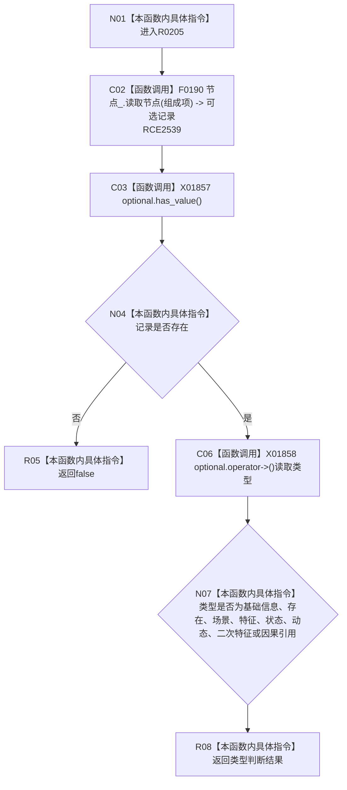

# CF-L8-0037 二次特征服务组成项可用现状流程图

图类型：现状流程图
代码版本：`3920a74638264f9f539d50f32f3c9fe5fb1982ab`
源码 blob：`ef359c1ba720ed96a64c81ca3fca2cb42a0824bd`
覆盖文件：`海中鱼巣/领域/二次特征服务.h:182-195`
唯一根函数：R0205
完整签名：`bool 海中鱼巣::二次特征服务::组成项可用(节点句柄 组成项) const`
参数：`组成项`，值传入的候选节点句柄
返回结果：节点记录不存在时返回 `false`；记录类型属于八类允许类型之一时返回 `true`，否则返回 `false`
已登记调用方：RCE0744
直接项目函数：RCE2539 → F0190
外部边界：X01857、X01858；未解析项目调用：0
逐行映射表：`流程图/代码流程图/L8/CF-L8-0037_二次特征服务组成项可用_逐行代码映射表.md`
依据：关系发布基线 `010784a906e8283644a63a742151f6457a847c38` 与冻结源码
结构读写：只读节点记录并计算类型集合成员关系
不得作为施工许可：是
不得宣称：组成项可用会创建、绑定或修复节点

## 流程图

## 当前边界

- `海中鱼巣/领域/二次特征服务.h:183` 是对 F0190 的直接成员调用，顶层已冻结稳定边 RCE2539。
- 八类允许类型是当前代码条件，不在本图升级为新规范。
