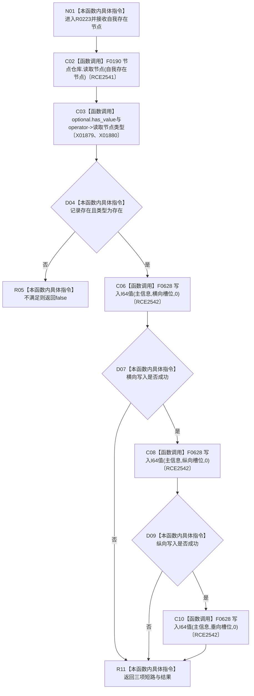

# CF-L8-0038 写入自我相对坐标零点现状流程图

图类型：现状流程图
代码版本：`3920a74638264f9f539d50f32f3c9fe5fb1982ab`
源码 blob：`77edcb28282c0ec33e7c695e063b1605e4fb37bf`
覆盖文件：`海中鱼巣/领域/初始化.世界树.ixx:111-119`
唯一根函数：R0223
完整签名：`bool 海中鱼巣::世界树初始化服务::写入自我相对坐标零点(海中鱼巣::节点句柄 自我存在节点)`
参数：自我存在节点句柄按值传入
返回结果：节点不存在或不是存在类型时返回 false；三个 I64 坐标槽位都写入 0 时返回 true
已登记调用方：RCE0294（F0635）
直接项目函数：F0190（RCE2541，`节点仓库::读取节点`）、F0628（RCE2542，三次 `主信息仓库::写入I64值`）
外部边界：X01879、X01880；未解析项目调用：0
调用图：`流程图/主程序可达调用关系/01_main可达项目调用边表.md`
逐行映射表：`流程图/代码流程图/L8/CF-L8-0038_写入自我相对坐标零点_逐行代码映射表.md`
偏差清单：无
依据：RCE0294、RCE2541、RCE2542、X01879、X01880 与当前源码
结构读取与写入：读取自我存在节点记录；向其主信息三个相对坐标槽位写入 0
逻辑内返回：节点不存在或类型不匹配返回 false；任一写入失败因短路返回 false
不得作为施工许可：是
不得宣称：三项写入成功证明世界树完整初始化

## 流程图

## 当前边界

- 三项写入按横向、纵向、垂向顺序短路执行，不具备本函数内回退。
