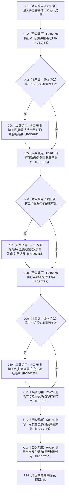

# CF-L8-0039 清理初始化结果现状流程图

图类型：现状流程图
代码版本：`3920a74638264f9f539d50f32f3c9fe5fb1982ab`
源码 blob：`77edcb28282c0ec33e7c695e063b1605e4fb37bf`
覆盖文件：`海中鱼巣/领域/初始化.世界树.ixx:136-149`
唯一根函数：R0225
完整签名：`void 海中鱼巣::世界树初始化服务::清理初始化结果(const 海中鱼巣::世界树初始化结果& 结果)`
参数：初始化结果以 const 引用借用
返回结果：`void`
已登记调用方：RCE0292（F0635）
直接项目函数：F0168（RCE0784，句柄有效）、R0075（RCE0785，删除关系）、R0224（RCE0786，删除节点及主信息）
外部边界：无；未解析项目调用：0
调用图：`流程图/主程序可达调用关系/01_main可达项目调用边表.md`
逐行映射表：`流程图/代码流程图/L8/CF-L8-0039_清理初始化结果_逐行代码映射表.md`
偏差清单：无
依据：RCE0292、RCE0784、RCE0785、RCE0786 与当前源码
结构读取与写入：按三个关系句柄有效性删除关系，再无条件请求删除三个节点及其主信息
逻辑内返回：无
不得作为施工许可：是
不得宣称：清理调用证明所有删除都成功；本函数忽略删除结果

## 流程图

## 当前边界

- 三个关系删除和三个节点清理均忽略返回值。
- 节点清理顺序为自我存在节点、自我所在场景、世界树根节点。
