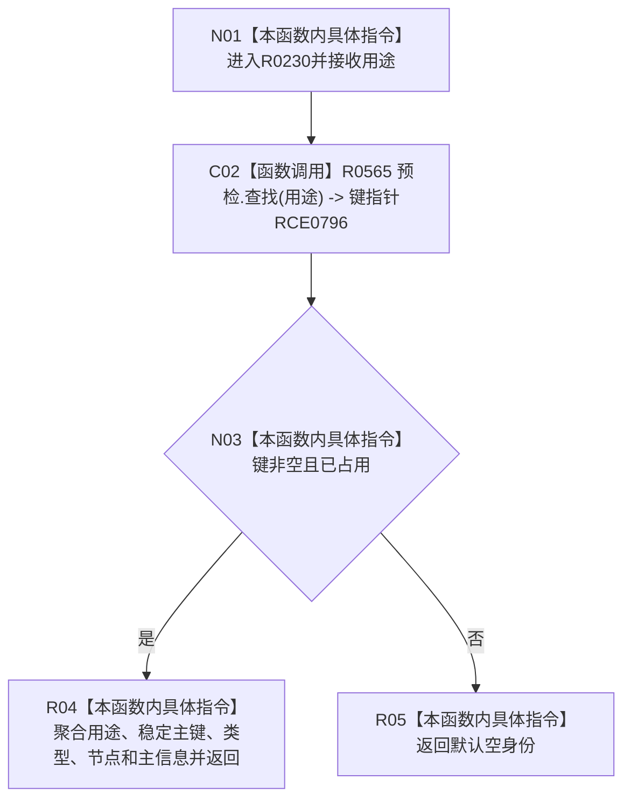

# CF-L8-0040 形成系统角色身份现状流程图

图类型：现状流程图
代码版本：`3920a74638264f9f539d50f32f3c9fe5fb1982ab`
源码 blob：`adf3fb33c53aa5aeaff2f7102bc9a4d7db3ba040`
覆盖文件：`海中鱼巣/领域/初始化.系统角色.ixx:239-246`
唯一根函数：R0230
完整签名：`static 系统角色身份材料 海中鱼巣::系统角色初始化器::形成身份(const 系统角色预检结果& 预检, 系统角色稳定键用途 用途) noexcept`
参数：预检只读借用；用途按值传入
返回结果：找到已占用键时返回完整身份材料，否则返回默认空身份
已登记调用方：RCE0797（R0231，21 个调用点）
直接项目函数：RCE0796 → R0565 `预检.查找(用途)`
外部边界：无；未解析项目调用：0
逐行映射表：`流程图/代码流程图/L8/CF-L8-0040_形成系统角色身份_逐行代码映射表.md`
依据：关系发布基线 `dbe710096193fbd517edae5cb871decaf6b49bf3` 与冻结源码
结构读写：只读预检材料，形成返回值
不得作为施工许可：是
不得宣称：非空身份证明对应领域语义已复核

## 流程图

## 当前边界

- 本函数不验证占用身份对应的业务结构，只搬运预检中冻结的五个字段。
