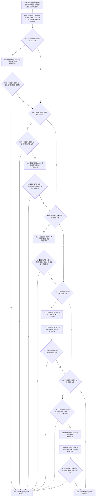

# CF-L8-0041 已有根需求语义匹配现状流程图

图类型：现状流程图
代码版本：`3920a74638264f9f539d50f32f3c9fe5fb1982ab`
源码 blob：`adf3fb33c53aa5aeaff2f7102bc9a4d7db3ba040`
覆盖文件：`海中鱼巣/领域/初始化.系统角色.ixx:337-401`
唯一根函数：R0233
完整签名：`bool 海中鱼巣::系统角色初始化器::已有根需求语义匹配(const 系统角色初始化参数& 参数, const 系统角色预检结果& 预检, bool 安全组) const`
参数：参数与预检只读借用；安全组按值选择安全或服务字段
返回结果：全部已占用组成员与对应领域材料匹配时返回 `true`
已登记调用方：RCE0799（R0232）
直接项目函数：RCE0803 → R0565；RCE0804 → R0407；RCE0805 → R0434；RCE2548 → R0755；RCE2549 → R0756；RCE2550 → R0757；RCE2551 → R0758；RCE2552 → R0759
外部边界：无；未解析项目调用：0
逐行映射表：`流程图/代码流程图/L8/CF-L8-0041_已有根需求语义匹配_逐行代码映射表.md`
依据：关系发布基线 `dbe710096193fbd517edae5cb871decaf6b49bf3` 与冻结源码
结构读写：只读预检与领域材料
不得作为施工许可：是
不得宣称：返回真证明未占用组成员已经创建

## 流程图

## 当前边界

- 每个组成员只有在预检标记已占用时才要求对应读回匹配。
- 五个显式服务读取已按 RCE2548—RCE2552 绑定稳定目标。
