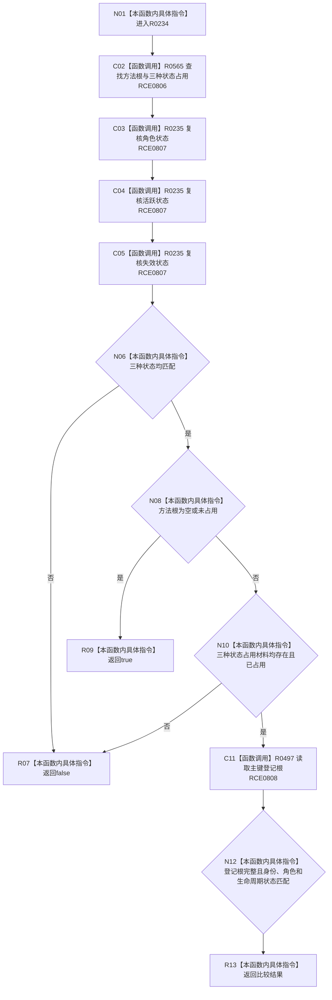

# CF-L8-0042 已有方法根语义匹配现状流程图

图类型：现状流程图
代码版本：`3920a74638264f9f539d50f32f3c9fe5fb1982ab`
源码 blob：`adf3fb33c53aa5aeaff2f7102bc9a4d7db3ba040`
覆盖文件：`海中鱼巣/领域/初始化.系统角色.ixx:403-423`
唯一根函数：R0234
完整签名：`bool 海中鱼巣::系统角色初始化器::已有方法根语义匹配(const 系统角色初始化参数& 参数, const 系统角色预检结果& 预检) const`
参数：参数与预检均为只读借用
返回结果：未占用方法根或已占用材料全部匹配时返回 `true`
已登记调用方：RCE0802（R0232）
直接项目函数：RCE0806 → R0565；RCE0807 → R0235；RCE0808 → R0497
外部边界：无；未解析项目调用：0
逐行映射表：`流程图/代码流程图/L8/CF-L8-0042_已有方法根语义匹配_逐行代码映射表.md`
依据：关系发布基线 `dbe710096193fbd517edae5cb871decaf6b49bf3` 与冻结源码
结构读写：只读预检、方法根与抽象状态材料
不得作为施工许可：是
不得宣称：返回真证明方法根已创建

## 流程图

## 当前边界

- 状态占用为空或未占用由 R0235 视为不需要匹配；方法根已经占用时才要求三种状态和登记根材料全部闭合。
