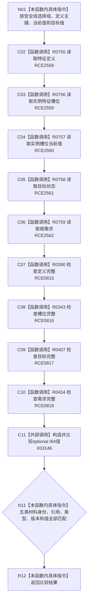

# CF-L8-0043 复核根需求组现状流程图

图类型：现状流程图
代码版本：`3920a74638264f9f539d50f32f3c9fe5fb1982ab`
源码 blob：`adf3fb33c53aa5aeaff2f7102bc9a4d7db3ba040`
覆盖文件：`海中鱼巣/领域/初始化.系统角色.ixx:479-512`
唯一根函数：R0237
完整签名：`bool 海中鱼巣::系统角色初始化器::复核根需求组(const 系统角色初始化参数& 参数, const 系统角色主体材料& 主体, bool 安全组) const`
参数：参数与主体只读借用；安全组按值选择安全或服务组
返回结果：组内定义、槽位、值、目标和需求材料全部匹配时返回 `true`
已登记调用方：RCE0810（R0236）
直接项目函数：RCE0815 → R0390；RCE0816 → R0343；RCE0817 → R0407；RCE0818 → R0434；RCE2558 → R0755；RCE2559 → R0756；RCE2560 → R0757；RCE2561 → R0758；RCE2562 → R0759
外部边界：X03146（501 行 `optional<std::int64_t>` 值构造与比较）；未解析项目调用：0
逐行映射表：`流程图/代码流程图/L8/CF-L8-0043_复核根需求组_逐行代码映射表.md`
依据：关系发布基线 `dbe710096193fbd517edae5cb871decaf6b49bf3` 与冻结源码
结构读写：只读根需求组及五类领域材料
不得作为施工许可：是
不得宣称：返回真证明材料由本函数发布

## 流程图

## 当前边界

- 487—491 行五个显式服务读取已按 RCE2558—RCE2562 绑定稳定目标。
