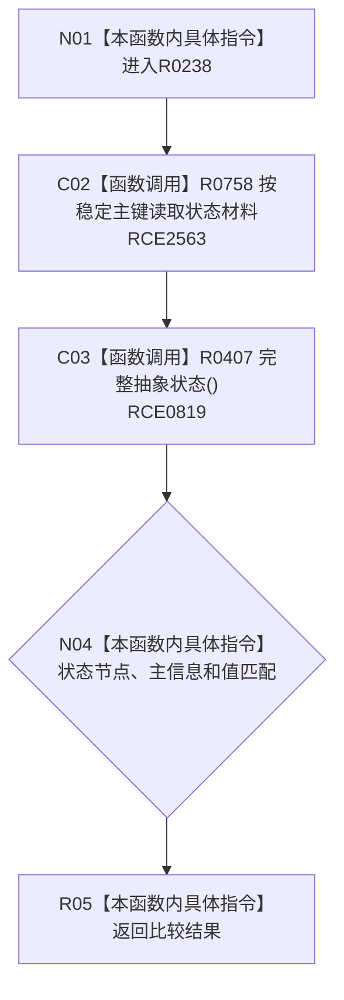

# CF-L8-0044 复核抽象状态现状流程图

图类型：现状流程图
代码版本：`3920a74638264f9f539d50f32f3c9fe5fb1982ab`
源码 blob：`adf3fb33c53aa5aeaff2f7102bc9a4d7db3ba040`
覆盖文件：`海中鱼巣/领域/初始化.系统角色.ixx:514-520`
唯一根函数：R0238
完整签名：`bool 海中鱼巣::系统角色初始化器::复核抽象状态(const 系统角色身份材料& 身份, std::int64_t 预期值) const`
参数：身份为只读借用；预期值按值传入
返回结果：状态材料完整且身份、主信息和值匹配时返回 `true`
已登记调用方：RCE0814（R0236）
直接项目函数：RCE2563 → R0758；RCE0819 → R0407
外部边界：无；未解析项目调用：0
逐行映射表：`流程图/代码流程图/L8/CF-L8-0044_复核抽象状态_逐行代码映射表.md`
依据：关系发布基线 `dbe710096193fbd517edae5cb871decaf6b49bf3` 与冻结源码
结构读写：只读身份与状态材料
不得作为施工许可：是
不得宣称：返回真证明状态由本函数创建

## 流程图

## 当前边界

- 517 行状态读取已绑定 RCE2563。
