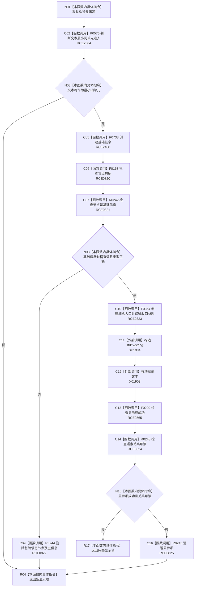

# CF-L8-0045 创建语素初始化显示项现状流程图

图类型：现状流程图
代码版本：`3920a74638264f9f539d50f32f3c9fe5fb1982ab`
源码 blob：`ba08c07c9863ba369a9b2a782a323ea5b5d206a5`
覆盖文件：`海中鱼巣/领域/初始化.语素.ixx:172-189`
唯一根函数：R0241
完整签名：`语素初始化显示项 海中鱼巣::语素初始化服务::创建显示项(std::wstring_view 文本)`
参数：文本为调用期只读视图
返回结果：完整可读时返回显示项；准入、创建或读回不满足时返回空显示项
已登记调用方：RCE0287（F0633）
直接项目函数：RCE2400 → R0733；RCE0820 → F0163；RCE0821 → R0242；RCE0822 → R0244；RCE0823 → F0364；RCE0824 → R0243；RCE0825 → R0245；RCE2564 → R0575；RCE2565 → F0220
外部边界：X01904（构造 `std::wstring`）；X01903（移动赋值文本）
逐行映射表：`流程图/代码流程图/L8/CF-L8-0045_创建语素初始化显示项_逐行代码映射表.md`
依据：关系发布基线 `dbe710096193fbd517edae5cb871decaf6b49bf3` 与冻结源码
结构读写：创建基础信息与概念入口；失败路径删除已建结构
不得作为施工许可：是
不得宣称：返回空值是无副作用的入口拒绝

## 流程图

## 当前边界

- RCE0820 已按节点句柄静态类型绑定 F0163；174 与 184 行分别绑定 RCE2564、RCE2565。
