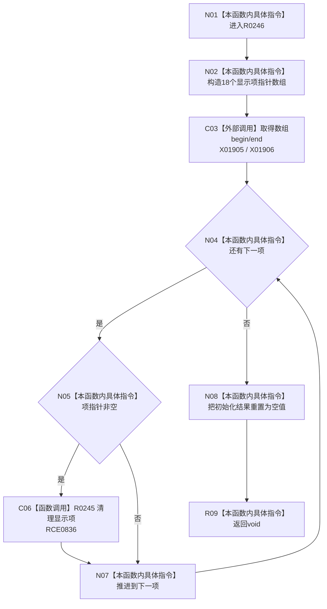

# CF-L8-0046 清理语素初始化结果现状流程图

图类型：现状流程图
代码版本：`3920a74638264f9f539d50f32f3c9fe5fb1982ab`
源码 blob：`ba08c07c9863ba369a9b2a782a323ea5b5d206a5`
覆盖文件：`海中鱼巣/领域/初始化.语素.ixx:241-268`
唯一根函数：R0246
完整签名：`void 海中鱼巣::语素初始化服务::清理初始化结果(语素初始化结果& 结果)`
参数：结果为可写借用
返回结果：`void`；逐项清理 18 个显示项后清空结果
已登记调用方：RCE0288（F0633）
直接项目函数：RCE0836 → R0245
外部边界：X01905（数组 `begin`）；X01906（数组 `end`）
逐行映射表：`流程图/代码流程图/L8/CF-L8-0046_清理语素初始化结果_逐行代码映射表.md`
依据：关系发布基线 `dbe710096193fbd517edae5cb871decaf6b49bf3` 与冻结源码
结构读写：逐项删除显示项承载的结构，最后清空结果材料
不得作为施工许可：是
不得宣称：函数返回证明每项删除成功

## 流程图

## 当前边界

- 循环不检查 R0245 内各删除调用结果，只在遍历后清空结果材料。
