# CF-L8-0047 初始化单根需求现状流程图

图类型：现状流程图
代码版本：`3920a74638264f9f539d50f32f3c9fe5fb1982ab`
源码 blob：`8b2bd4e4d44b747d661d82401db6aea5901c67da`
覆盖文件：`海中鱼巣/领域/初始化.需求.ixx:115-182`
唯一根函数：R0249
完整签名：`单根需求初始化结果 海中鱼巣::需求初始化服务::初始化单根需求(std::wstring_view 概念文本, std::uint64_t 语素稳定键, std::int64_t 当前值, std::int64_t 目标值, 节点句柄 自我存在, 节点句柄 自我场景)`
参数：概念文本为调用期只读视图；稳定键和值按值传入；自我存在与场景为节点句柄值
返回结果：完整创建并读回一致时返回单根需求初始化结果；任一追根因检查失败时返回空结果
已登记调用方：RCE0300（F0636）
直接项目函数：RCE0838 → R0560；RCE0839 已校正 → F0163；RCE0840 → F0184；RCE0841 → F0364；RCE0842 → R0562；RCE0843 → R0579；RCE0844 → R0581；RCE0845 → F0554；RCE0846 → F0555；RCE0847 → R0586；RCE0848 → F0496；RCE0849 → F0497；RCE2569 → R0762；RCE2570 → R0763；RCE2571 → F0363；RCE2572 → F0329；RCE2573 → F0350
外部边界：X01921—X01930、X01932；X03143（`optional::value_or`）；X03144（`optional::has_value`）；X01931、X01933—X01936 已确认停用
逐行映射表：`流程图/代码流程图/L8/CF-L8-0047_初始化单根需求_逐行代码映射表.md`
依据：关系发布基线 `dbe710096193fbd517edae5cb871decaf6b49bf3` 与冻结源码
结构读写：依次创建特征定义、语素入口、实例槽位、特征值、目标状态需求，并读回完整结构
不得作为施工许可：是
不得宣称：空结果表示已经撤销此前创建的结构

## 流程图

```mermaid
flowchart TD
    N01["N01【本函数内具体指令】默认构造初始化结果"]
    C02["C02【函数调用】R0560 创建特征类型<br/>RCE0838"]
    C03["C03【函数调用】F0163 检查节点句柄<br/>RCE0839"]
    C04["C04【函数调用】F0184 追根因检查特征定义创建<br/>RCE0840"]
    R06["R06【本函数内具体指令】返回空结果"]
    C07["C07【函数调用】F0364 创建概念入口并保留收口材料<br/>RCE0841"]
    C08["C08【函数调用】F0363 检查语素入口结果成功<br/>RCE2571"]
    N09{"N09【本函数内具体指令】入口主键及本次绑定标记匹配"}
    C10["C10【函数调用】F0184 追根因检查语素入口<br/>RCE0840"]
    C11["C11【函数调用】R0762 创建实例特征槽位<br/>RCE2569"]
    C12["C12【函数调用】F0163 检查槽位句柄<br/>RCE0839"]
    C13["C13【函数调用】F0184 追根因检查槽位创建<br/>RCE0840"]
    C14["C14【函数调用】R0763 创建特征值<br/>RCE2570"]
    C15["C15【函数调用】F0163 检查特征值句柄<br/>RCE0839"]
    C16["C16【函数调用】R0562 写入I64特征值<br/>RCE0842"]
    C17["C17【函数调用】F0184 追根因检查特征值写入<br/>RCE0840"]
    C18["C18【函数调用】R0579 创建自我目标状态需求<br/>RCE0843"]
    C19["C19【函数调用】F0163 检查需求句柄<br/>RCE0839"]
    C20["C20【函数调用】F0184 追根因检查需求创建<br/>RCE0840"]
    C21["C21【函数调用】R0581 读取需求目标状态并value_or空句柄<br/>RCE0844 / X03143"]
    C22["C22【函数调用】F0554 读取宿主特征槽位<br/>RCE0845"]
    C23["C23【函数调用】F0555 读取I64特征值<br/>RCE0846"]
    C24["C24【函数调用】F0329 读取状态值<br/>RCE2572"]
    C25["C25【函数调用】R0586 读取需求承接材料<br/>RCE0847"]
    C26["C26【函数调用】F0496 读取入口绑定目标组<br/>RCE0848"]
    C27["C27【函数调用】F0497 读取入口概念追溯组<br/>RCE0849"]
    C28["C28【函数调用】F0350 检查初始化结果成功<br/>RCE2573"]
    C29["C29【外部调用】比较三个optional读回值<br/>X01921 / X01922 / X01923"]
    N30{"N30【本函数内具体指令】经X03144确认承接材料存在且主体、宿主、场景和目标匹配"}
    C31["C31【外部调用】两次std::find并比较迭代器<br/>X01924—X01930 / X01932"]
    N32{"N32【本函数内具体指令】完整读回合取结果为真"}
    C33["C33【函数调用】F0184 追根因检查完整读回<br/>RCE0840"]
    R34["R34【本函数内具体指令】返回完整结果"]

    N01 --> C02 --> C03 --> C04
    C04 -- 失败 --> R06
    C04 -- 通过 --> C07 --> C08 --> N09 --> C10
    C10 -- 失败 --> R06
    C10 -- 通过 --> C11 --> C12 --> C13
    C13 -- 失败 --> R06
    C13 -- 通过 --> C14 --> C15 --> C16 --> C17
    C17 -- 失败 --> R06
    C17 -- 通过 --> C18 --> C19 --> C20
    C20 -- 失败 --> R06
    C20 -- 通过 --> C21 --> C22 --> C23 --> C24 --> C25 --> C26 --> C27 --> C28 --> C29 --> N30 --> C31 --> N32 --> C33
    C33 -- 失败 --> R06
    C33 -- 通过 --> R34
```

## 当前边界

- 源码每次追根因检查失败都直接返回空结果，没有在本函数内撤销前序已创建结构。
- X01931 与 X01933—X01936 已从聚合停用，不设替代。
