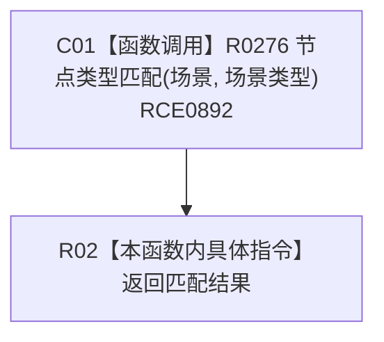

# CF-L8-0048 场景是否有效现状流程图

图类型：现状流程图
代码版本：`3920a74638264f9f539d50f32f3c9fe5fb1982ab`
源码 blob：`ae4a5c34a3a725f7b2cd53e994ed0bec655a36b5`
覆盖文件：`海中鱼巣/领域/场景服务.h:52-54`
唯一根函数：R0275
完整签名：`bool 海中鱼巣::场景服务::场景是否有效(节点句柄 场景) const`
参数：场景为按值传入的节点句柄
返回结果：返回场景句柄是否指向场景类型节点
已登记调用方：RCE0290（F0635）
直接项目函数：RCE0892 → R0276
外部边界：无；未解析项目调用：0
逐行映射表：`流程图/代码流程图/L8/CF-L8-0048_场景是否有效_逐行代码映射表.md`
依据：关系发布基线 `57c7ef1a4dc96083bd5ea570400c90cae5eaefc5` 与冻结源码
结构读写：只读节点类型
不得作为施工许可：是
不得宣称：返回真证明场景结构完整

## 流程图

## 当前边界

- 本函数只转发类型匹配结果，不读取场景关系或成员结构。
