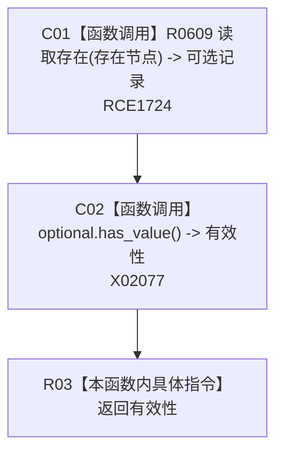

# CF-L8-0049 存在是否有效现状流程图

图类型：现状流程图
代码版本：`3920a74638264f9f539d50f32f3c9fe5fb1982ab`
源码 blob：`045d1eb190f44a38cc129974c2681969fedba9d5`
覆盖文件：`海中鱼巣/领域/存在服务.h:139-141`
唯一根函数：R0277
完整签名：`bool 海中鱼巣::存在服务::存在是否有效(节点句柄 存在节点) const`
参数：存在节点为按值传入的节点句柄
返回结果：读取存在记录后返回可选值是否有值
已登记调用方：RCE0291（F0635）
直接项目函数：RCE1724 → R0609
外部边界：X02077；未解析项目调用：0
逐行映射表：`流程图/代码流程图/L8/CF-L8-0049_存在是否有效_逐行代码映射表.md`
依据：关系发布基线 `57c7ef1a4dc96083bd5ea570400c90cae5eaefc5` 与冻结源码
结构读写：只读存在节点记录
不得作为施工许可：是
不得宣称：有记录证明存在结构关系完整

## 流程图

## 当前边界

- 具体节点类型复核在 R0609 内部，本函数只读取其可选返回状态。
