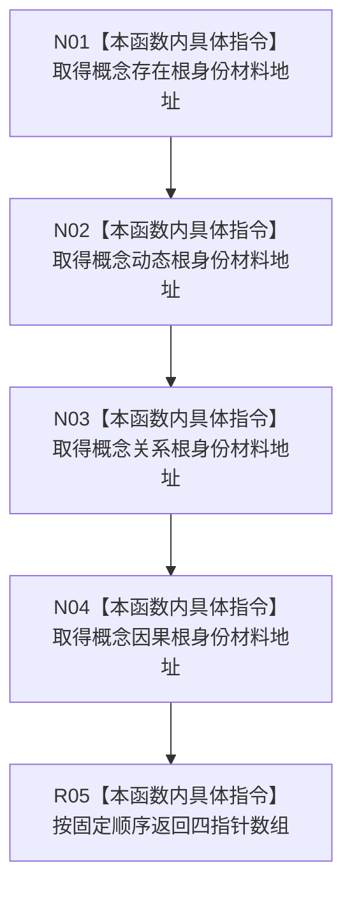

# CF-L8-0050 概念活动读取根身份组现状流程图

图类型：现状流程图
代码版本：`3920a74638264f9f539d50f32f3c9fe5fb1982ab`
源码 blob：`0a902454f56f7ee20e65f81ea6864e923a9c7f6a`
覆盖文件：`海中鱼巣/领域/数据操作.概念活动.ixx:187-194`
唯一根函数：R0332
完整签名：`static std::array<const 海中鱼巣::系统角色身份材料*, 4> 海中鱼巣::概念活动数据操作::读取根身份组(const 海中鱼巣::系统角色清单& 系统角色) noexcept`
参数：系统角色为调用期只读引用
返回结果：按存在、动态、关系、因果顺序返回四个概念根身份材料的只读指针数组
已登记调用方：R0331、R0340
直接项目函数：无
外部边界：无；未解析项目调用：0
逐行映射表：`流程图/代码流程图/L8/CF-L8-0050_概念活动读取根身份组_逐行代码映射表.md`
依据：关系发布基线 `57c7ef1a4dc96083bd5ea570400c90cae5eaefc5` 与冻结源码
结构读写：只读取系统角色清单内四个身份成员的地址
不得作为施工许可：是
不得宣称：返回指针数组验证了四个根身份完整或当前可读

## 流程图

## 当前边界

- 返回值只借用 `系统角色` 内部成员，调用方必须保证其生命周期覆盖使用期。
