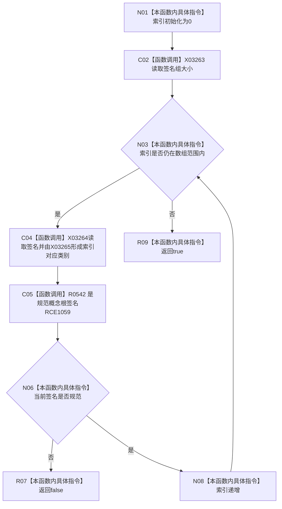

# CF-L8-0051 概念活动签名组规范现状流程图

图类型：现状流程图
代码版本：`3920a74638264f9f539d50f32f3c9fe5fb1982ab`
源码 blob：`0a902454f56f7ee20e65f81ea6864e923a9c7f6a`
覆盖文件：`海中鱼巣/领域/数据操作.概念活动.ixx:196-202`
唯一根函数：R0333
完整签名：`static bool 海中鱼巣::概念活动数据操作::签名组规范(const std::array<海中鱼巣::概念签名材料, 4>& 签名组) noexcept`
参数：签名组为固定四项只读引用
返回结果：四项均满足对应序号概念根签名时返回 `true`；首个不规范项返回 `false`
已登记调用方：R0331、R0340
直接项目函数：RCE1059 → R0542
外部边界：X03263—X03265
逐行映射表：`流程图/代码流程图/L8/CF-L8-0051_概念活动签名组规范_逐行代码映射表.md`
依据：关系发布基线 `57c7ef1a4dc96083bd5ea570400c90cae5eaefc5` 与冻结源码
结构读写：只读签名数组
不得作为施工许可：是
不得宣称：签名规范代表对应概念根已存在或可读

## 流程图

## 当前边界

- 数组固定四项，类别按 `索引 + 1` 转换。
