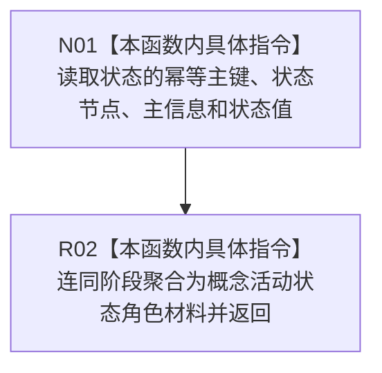

# CF-L8-0052 概念活动形成状态角色现状流程图

图类型：现状流程图
代码版本：`3920a74638264f9f539d50f32f3c9fe5fb1982ab`
源码 blob：`0a902454f56f7ee20e65f81ea6864e923a9c7f6a`
覆盖文件：`海中鱼巣/领域/数据操作.概念活动.ixx:204-209`
唯一根函数：R0334
完整签名：`static 海中鱼巣::概念活动状态角色材料 海中鱼巣::概念活动数据操作::形成状态角色(海中鱼巣::运行期概念生命周期阶段 阶段, const 海中鱼巣::状态值式材料& 状态) noexcept`
参数：阶段按值传入；状态为调用期只读引用
返回结果：返回由阶段及状态的幂等主键、状态节点、主信息和值组成的角色材料
已登记调用方：R0331、R0341
直接项目函数：无
外部边界：无；未解析项目调用：0
逐行映射表：`流程图/代码流程图/L8/CF-L8-0052_概念活动形成状态角色_逐行代码映射表.md`
依据：关系发布基线 `57c7ef1a4dc96083bd5ea570400c90cae5eaefc5` 与冻结源码
结构读写：只复制值式材料字段
不得作为施工许可：是
不得宣称：形成角色材料代表其完整性或仓库事实已复核

## 流程图

## 当前边界

- 本函数不调用完整性检查，也不访问仓库。
