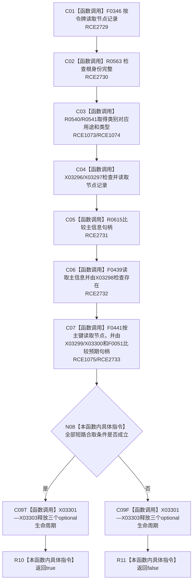

# CF-L8-0053 概念活动复核根身份已许可现状流程图

图类型：现状流程图
代码版本：`3920a74638264f9f539d50f32f3c9fe5fb1982ab`
源码 blob：`0a902454f56f7ee20e65f81ea6864e923a9c7f6a`
覆盖文件：`海中鱼巣/领域/数据操作.概念活动.ixx:288-300`
唯一根函数：R0338
完整签名：`bool 海中鱼巣::概念活动数据操作::复核根身份_已许可(const 海中鱼巣::系统角色身份材料& 根, 海中鱼巣::概念根类别 类别, const 海中鱼巣::结构事务令牌& 令牌) const`
参数：根和令牌为只读引用；类别按值传入
返回结果：根材料、用途、类型、节点记录、主信息和主键绑定全部一致时返回 `true`，否则返回 `false`
已登记调用方：R0331
直接项目函数：RCE1073 → R0540；RCE1074 → R0541；RCE1075 → F0441；RCE2729 → F0346；RCE2730 → R0563；RCE2731 → R0615；RCE2732 → F0439；RCE2733 → F0051
外部边界：X03296—X03303
逐行映射表：`流程图/代码流程图/L8/CF-L8-0053_概念活动复核根身份已许可_逐行代码映射表.md`
依据：关系发布基线 `57c7ef1a4dc96083bd5ea570400c90cae5eaefc5` 与冻结源码
结构读写：在既有令牌下只读节点、主信息和索引
不得作为施工许可：是
不得宣称：返回 `true` 代表取得了新的许可或改变了根身份

## 流程图

## 当前边界

- 本函数依赖调用方提供的结构事务令牌，不自行取得或释放许可。
