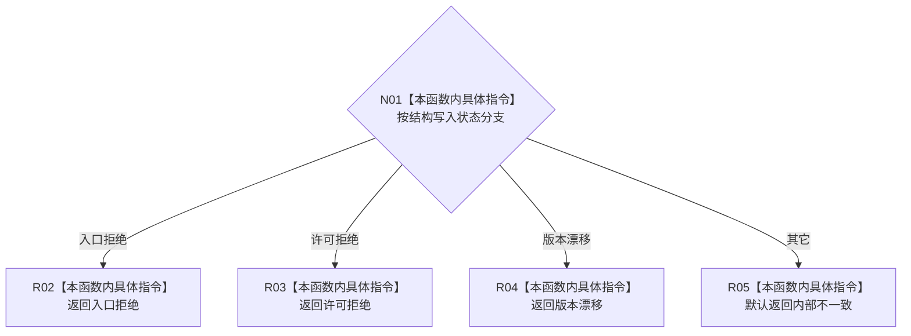

# CF-L8-0054 概念活动映射结构失败现状流程图

图类型：现状流程图
代码版本：`3920a74638264f9f539d50f32f3c9fe5fb1982ab`
源码 blob：`0a902454f56f7ee20e65f81ea6864e923a9c7f6a`
覆盖文件：`海中鱼巣/领域/数据操作.概念活动.ixx:302-309`
唯一根函数：R0339
完整签名：`static 海中鱼巣::概念活动业务状态 海中鱼巣::概念活动数据操作::映射结构失败(海中鱼巣::结构写入状态 状态) noexcept`
参数：结构写入状态按值传入
返回结果：入口拒绝、许可拒绝、版本漂移分别映射为同名业务状态，其它状态映射为内部不一致
已登记调用方：R0340
直接项目函数：无
外部边界：无；未解析项目调用：0
逐行映射表：`流程图/代码流程图/L8/CF-L8-0054_概念活动映射结构失败_逐行代码映射表.md`
依据：关系发布基线 `57c7ef1a4dc96083bd5ea570400c90cae5eaefc5` 与冻结源码
结构读写：无
不得作为施工许可：是
不得宣称：返回业务状态改变或修复了结构写入结果

## 流程图

## 当前边界

- 本函数是纯枚举映射，不保留原结构结果的其它字段。
