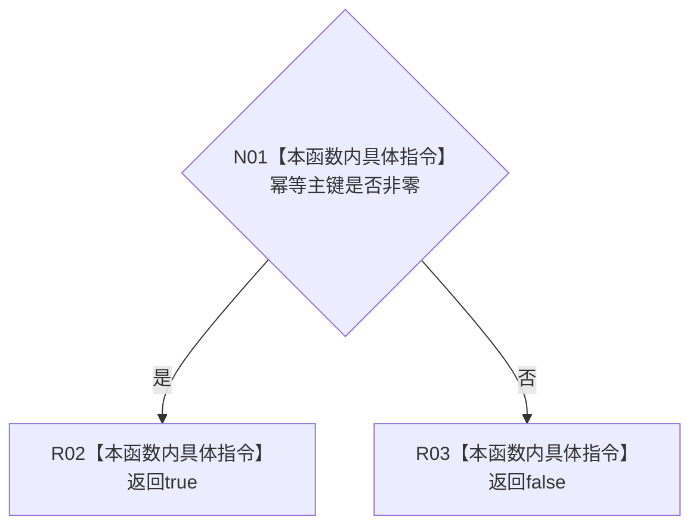

# CF-L8-0055 抽象状态写入规格完整现状流程图

图类型：现状流程图
代码版本：`3920a74638264f9f539d50f32f3c9fe5fb1982ab`
源码 blob：`cc399ea69282bf3ae0b0d59c7f0b587e5164b187`
覆盖文件：`海中鱼巣/领域/数据操作.状态动态.ixx:211`
唯一根函数：R0795
完整签名：`bool 海中鱼巣::抽象状态写入规格::完整() const noexcept`
参数：无；只读当前规格对象
返回结果：幂等主键非零返回 `true`，否则返回 `false`
已登记调用方：R0340（RCE2737，三处调用）
直接项目函数：无
外部边界：无；未解析项目调用：0
逐行映射表：`流程图/代码流程图/L8/CF-L8-0055_抽象状态写入规格完整_逐行代码映射表.md`
依据：关系发布基线 `57c7ef1a4dc96083bd5ea570400c90cae5eaefc5`、R0795 / RCE2737 稳定裁决与冻结源码
结构读写：只读幂等主键值
不得作为施工许可：是
不得宣称：规格完整代表状态已经写入、提交或发布

## 流程图

## 当前边界

- 本函数只判断主键值，不检查状态值、来源或仓库绑定。
