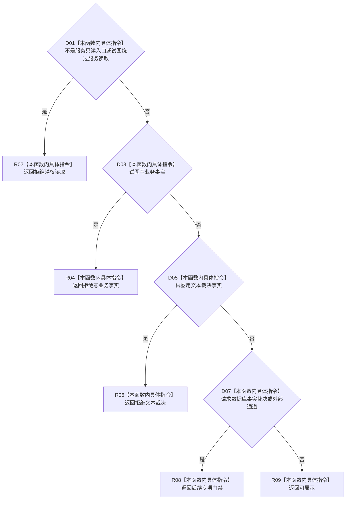

# CF-L8-0056 判定控制面板请求状态现状流程图

图类型：现状流程图
代码版本：`3920a74638264f9f539d50f32f3c9fe5fb1982ab`
源码 blob：`b0b4cdc2cd7e7fd6801f36c7a43bc27595ca89d9`
覆盖文件：`海中鱼巣/领域/控制面板服务.h:1772-1786`
唯一根函数：R0302
完整签名：`控制面板请求状态 海中鱼巣::控制面板服务::判定请求状态(const 控制面板请求& 请求) const`
参数：控制面板请求以 const 引用借用
返回结果：按越权、写事实、文本裁决、后续专项门禁顺序返回首个拒绝状态，否则返回可展示
已登记调用方：R0304（RCE0988）、R0307（RCE0991）、R0308（RCE1005）
直接项目函数：无
外部边界：无
逐行映射表：`流程图/代码流程图/L8/CF-L8-0056_判定控制面板请求状态_逐行代码映射表.md`
依据：冻结源码与既有入边
结构读写：无，只读请求标记
不得作为施工许可：是
不得宣称：可展示状态允许写业务事实

## 流程图

## 当前边界

- 本函数只裁决请求标记，不读取数据库、外部通道或任何业务仓库。
