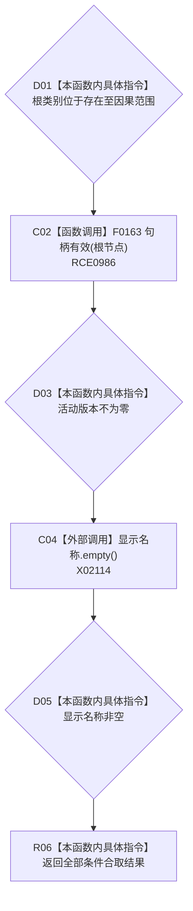

# CF-L8-0057 控制面板概念根选项完整现状流程图

图类型：现状流程图
代码版本：`3920a74638264f9f539d50f32f3c9fe5fb1982ab`
源码 blob：`b0b4cdc2cd7e7fd6801f36c7a43bc27595ca89d9`
覆盖文件：`海中鱼巣/领域/控制面板服务.h:200-206`
唯一根函数：R0303
完整签名：`bool 海中鱼巣::控制面板概念根选项::完整() const`
参数：无显式参数；只读访问当前选项字段
返回结果：根类别在存在至因果范围、根节点句柄有效、活动版本非零且显示名称非空时返回 `true`
已登记调用方：R0176（RCE0688）、R0192（RCE0706）、R0323（RCE1032）
直接项目函数：F0163（RCE0986）；RCE0987 已建议停用
外部边界：X02114
逐行映射表：`流程图/代码流程图/L8/CF-L8-0057_控制面板概念根选项完整_逐行代码映射表.md`
依据：冻结源码静态类型；根节点字段为 `节点句柄`
结构读写：无，只读字段
不得作为施工许可：是
不得宣称：完整选项已证明对应概念根当前活动

## 流程图

## 当前边界

- 根节点静态类型是 `节点句柄`，只解析到 F0163；F0168 是关系句柄重载，RCE0987 不可能由本调用点命中。
