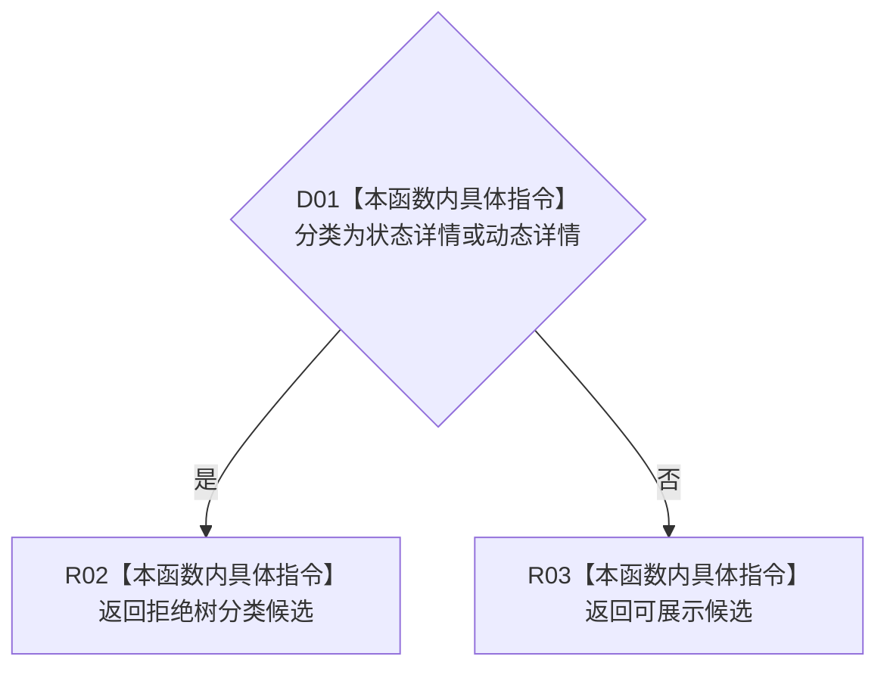

# CF-L8-0058 生成树视图候选材料现状流程图

图类型：现状流程图
代码版本：`3920a74638264f9f539d50f32f3c9fe5fb1982ab`
源码 blob：`b0b4cdc2cd7e7fd6801f36c7a43bc27595ca89d9`
覆盖文件：`海中鱼巣/领域/控制面板服务.h:293-298`
唯一根函数：R0305
完整签名：`控制面板树视图材料 海中鱼巣::控制面板服务::生成树视图候选材料(控制面板树分类 分类) const`
参数：树分类按值传入
返回结果：状态详情或动态详情返回拒绝树分类；其余分类返回可展示候选
已登记调用方：R0306（RCE0990，六处）
直接项目函数：无
外部边界：无
逐行映射表：`流程图/代码流程图/L8/CF-L8-0058_生成树视图候选材料_逐行代码映射表.md`
依据：冻结源码与既有入边
结构读写：无，只构造返回材料
不得作为施工许可：是
不得宣称：候选材料已经包含真实树结构

## 流程图

## 当前边界

- 返回值仅表达分类候选状态，不读取或构造任何真实树节点。
