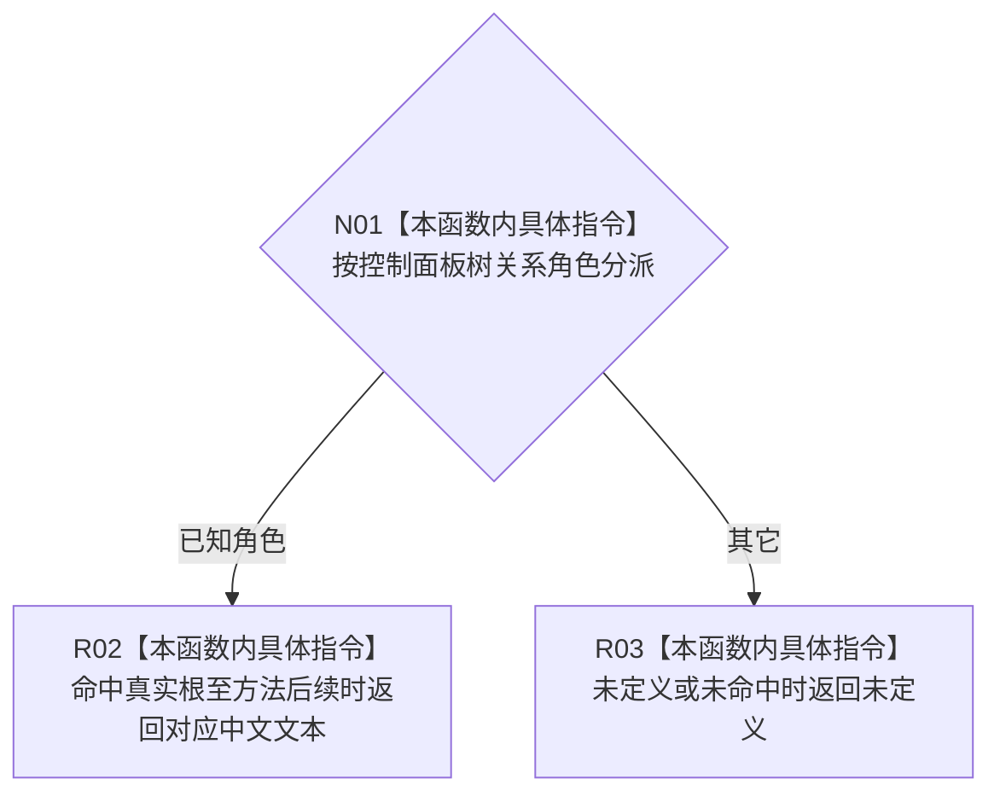

# CF-L8-0060 控制面板树关系角色文本现状流程图

图类型：现状流程图
代码版本：`3920a74638264f9f539d50f32f3c9fe5fb1982ab`
源码 blob：`b0b4cdc2cd7e7fd6801f36c7a43bc27595ca89d9`
覆盖文件：`海中鱼巣/领域/控制面板服务.h:94-137`
唯一根函数：R0327
完整签名：`const wchar_t* 海中鱼巣::控制面板树关系角色文本(海中鱼巣::控制面板树关系角色 角色)`
参数：关系角色按值传入
返回结果：已知角色返回对应中文常量文本；未定义及未命中值返回“未定义”
已登记调用方：RCE0634（R0153）、RCE1036（R0324）
直接项目函数：无；外部边界：无；未解析项目调用：0
逐行映射表：`流程图/代码流程图/L8/CF-L8-0060_控制面板树关系角色文本_逐行代码映射表.md`
依据：冻结源码与当前正式调用关系
结构读写：无，只映射枚举到显示文本
不得作为施工许可：是
不得宣称：角色文本是关系存在、类型或有效性的权威事实

## 流程图

## 当前边界

- 返回文本仅供显示层解释材料，不参与业务关系裁决。
