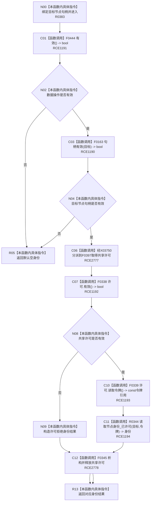

# CF-L8-0061 特征体系读取节点身份现状流程图

图类型：现状流程图
代码版本：`3920a74638264f9f539d50f32f3c9fe5fb1982ab`
源码 blob：`a47cd9b07794d30abc6cb9d1df319056105cd596`
覆盖文件：`海中鱼巣/领域/数据操作.特征体系.ixx:563-568`
唯一根函数：R0383
完整签名：`特征节点身份 海中鱼巣::特征体系数据操作::读取节点身份(节点句柄 目标) const`
参数：`目标` 按值输入；函数只在入口有效后取得运行期共享许可
返回结果：入口无效时返回默认空身份；许可拒绝时返回状态为 `许可拒绝` 的身份；许可有效时返回 R0344 的已许可读取结果
调用图：`流程图/主程序可达调用关系/01_main可达项目调用边表.md`
已登记调用方：R0389、R0697、R0701（RCE1219、RCE2071、RCE2082）
直接项目函数：F0444（RCE1191）、F0163（校正后的 RCE1190）、F0397（RCE2777）、F0338（RCE1192）、F0339（RCE1193）、R0344（RCE1194）、F0345（RCE2778）
外部边界：X03750（共享许可函数指针分派）
未解析项目调用：0
逐行映射表：`流程图/代码流程图/L8/CF-L8-0061_特征体系读取节点身份_逐行代码映射表.md`
依据提交 / 结构化消息：调用关系发布基线 `caab8644416dea13ea598b714289d1c86ac05304`；冻结源码提交 `3920a74638264f9f539d50f32f3c9fe5fb1982ab`
结构读取与写入：只读数据操作有效性、节点句柄和已发布结构；共享许可在所有许可后路径退出时释放
逻辑内返回：数据操作无效、目标句柄无效或共享许可拒绝
内部错误边界：R0344 在前置通过后的内部结构异常口径由其独立现状图承载
不得作为施工许可：是
不得宣称：返回非空身份表示目标一定是特征定义、实例槽位或特征值

## 流程图

## 当前边界

- RCE1190 原误绑到关系句柄重载 F0168；`目标` 的静态类型是 `节点句柄`，真实目标为 F0163。
- RCE1191 只对应第 564 行本对象 `有效()`；原聚合误把第 566 行 `许可.有效()` 也列为 F0444，第 566 行实际由 RCE1192 绑定 F0338。
- 第 565 行函数指针在当前生产接线唯一解析到 F0397，同时保留 X03750 的函数指针分派边界；局部许可由 RCE2778 在全部许可后返回路径调用 F0345 释放。
- R0344 的非平凡内部过程由 `流程图/代码流程图/L9/CF-L9-0051_特征体系读取节点身份已许可_现状流程图.md` 独立承载。
