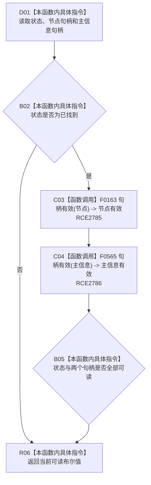

# CF-L8-0062 特征节点身份当前可读现状流程图

图类型：现状流程图
代码版本：`3920a74638264f9f539d50f32f3c9fe5fb1982ab`
源码 blob：`a47cd9b07794d30abc6cb9d1df319056105cd596`
覆盖文件：`海中鱼巣/领域/数据操作.特征体系.ixx:74-77`
唯一根函数：R0388
完整签名：`bool 海中鱼巣::特征节点身份::当前可读() const noexcept`
参数：无；隐式 `this` 为只读借用，不延长特征节点身份生命周期
返回结果：状态为已找到且节点句柄、主信息句柄均有效时返回 true，否则返回 false
调用图：`流程图/主程序可达调用关系/01_main可达项目调用边表.md`
逐行映射表：`流程图/代码流程图/L8/CF-L8-0062_特征节点身份当前可读_逐行代码映射表.md`
输入契约 / 调用语境表：调用方持有的值式节点身份
非成功返回二分审查表：false 保留读取状态给调用方；上游已保证可读后的 false 属于追根因对象
偏差清单：RCE1215 将两个不同句柄字段误绑到关系句柄重载，停用并由 RCE2785、RCE2786 替代
依据提交 / 结构化消息：聚合关系基线 `caab8644416dea13ea598b714289d1c86ac05304`；冻结源码提交 `3920a74638264f9f539d50f32f3c9fe5fb1982ab`
验证输出：本批 Mermaid、节点双向、源码覆盖与差异格式检查
不得作为施工许可：是
不得宣称：返回 true 表示节点或主信息在后续事务中始终当前

## 流程图

## 当前边界

- `节点` 的静态类型为 `节点句柄`，精确绑定 F0163；`主信息` 的静态类型为 `主信息句柄`，精确绑定 F0565。
- 旧 RCE1215 指向 F0168 `关系句柄` 重载，与两个实参静态类型均不相符。
