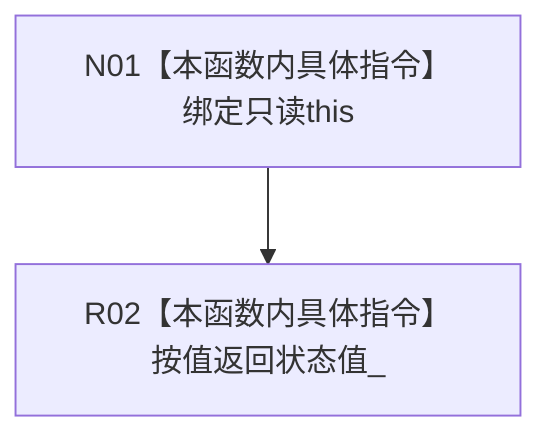

# CF-L8-0065 抽象状态写入规格读取状态值现状流程图

图类型：现状流程图
代码版本：`3920a74638264f9f539d50f32f3c9fe5fb1982ab`
源码 blob：`cc399ea69282bf3ae0b0d59c7f0b587e5164b187`
覆盖文件：`海中鱼巣/领域/数据操作.状态动态.ixx:210`
唯一根函数：R0400
完整签名：`std::int64_t 海中鱼巣::抽象状态写入规格::读取状态值() const noexcept`
参数：无显式参数；隐式 `this` 为只读借用
返回结果：按值返回私有成员 `状态值_`
已登记调用方：R0340、R0403、R0460（RCE1266、RCE1429、RCE2739）
直接项目函数：无
外部边界：无
逐行映射表：`流程图/代码流程图/L8/CF-L8-0065_抽象状态写入规格读取状态值_逐行代码映射表.md`
结构读取与写入：只读规格成员，不改变机器结构
不得作为施工许可：是

## 流程图

## 当前边界

- 状态值允许为任意 `std::int64_t`；本访问器不附加值域判断。
