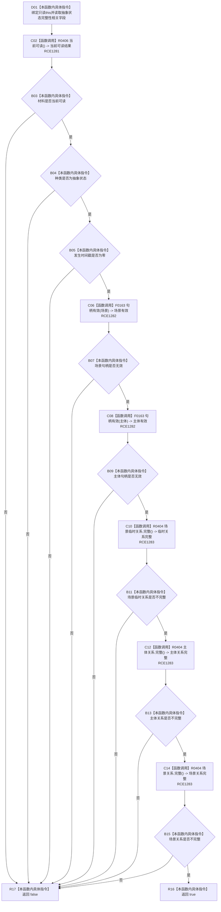

# CF-L8-0066 状态值式材料完整抽象状态现状流程图

图类型：现状流程图
代码版本：`3920a74638264f9f539d50f32f3c9fe5fb1982ab`
源码 blob：`cc399ea69282bf3ae0b0d59c7f0b587e5164b187`
覆盖文件：`海中鱼巣/领域/数据操作.状态动态.ixx:95-99`
唯一根函数：R0407
完整签名：`bool 海中鱼巣::状态值式材料::完整抽象状态() const noexcept`
参数：无显式参数；隐式 `this` 为只读借用，不延长状态值式材料生命周期
返回结果：材料当前可读、种类为抽象状态、发生时间戳为零、场景与主体句柄均无效且三份关系证据均不完整时返回 true，否则返回 false
已登记调用方：R0233、R0235、R0237、R0238、R0331、R0401、R0405、R0460（RCE0804、RCE0809、RCE0817、RCE0819、RCE1052、RCE1256、RCE1278、RCE1427）
直接项目函数：R0406（RCE1281）、F0163（RCE1282）、R0404（RCE1283）
外部边界：无
逐行映射表：`流程图/代码流程图/L8/CF-L8-0066_状态值式材料完整抽象状态_逐行代码映射表.md`
结构读取与写入：只读状态值式材料及其三份关系值式证据；不回读仓库，不改变机器结构
逻辑内返回：允许非抽象状态、实例状态或结构不完整的候选材料返回 false
内部错误边界：上游已经保证材料为完整抽象状态后仍返回 false 时，由调用方追查材料种类、实例字段或关系证据残留
依据提交 / 结构化消息：当前维护基线 `7951b1bea78c7338643ab18428180d521e4d5a62`；冻结源码提交 `3920a74638264f9f539d50f32f3c9fe5fb1982ab`
验证输出：本批 Mermaid、节点双向、源码覆盖与差异格式检查
不得作为施工许可：是
不得宣称：返回 true 表示抽象状态仍在仓库中有效、当前或满足领域基数

## 流程图

## 当前边界

- RCE1282 在第 97 行覆盖 `场景`、`主体` 两次节点句柄有效性调用；本函数要求两次调用结果均为 false。
- RCE1283 在第 98 行覆盖场景临时关系、主体关系、场景关系三次 R0404 调用；本函数要求三次调用结果均为 false。
- 本函数把抽象状态与实例状态字段严格分账，但不回读状态节点、主信息或关系仓库的当前性。
