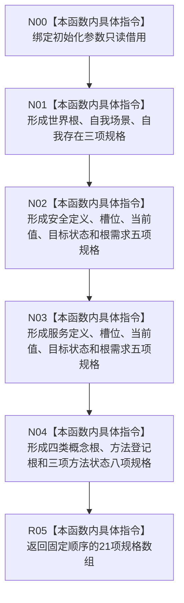

# CF-L8-0067 系统角色形成键规格组现状流程图

图类型：现状流程图
代码版本：`3920a74638264f9f539d50f32f3c9fe5fb1982ab`
源码 blob：`b24322d4588808299a232bc308bebd463b7a87a0`
覆盖文件：`海中鱼巣/领域/数据操作.系统角色.ixx:195-220`
唯一根函数：R0411
完整签名：`static std::array<海中鱼巣::系统角色键占用材料, 海中鱼巣::系统角色稳定键数量> 海中鱼巣::系统角色数据操作::形成键规格组(const 海中鱼巣::系统角色初始化参数& 参数) noexcept`
参数：`参数` 为调用方拥有的只读借用
返回结果：按稳定用途顺序形成 21 项用途—稳定主键—预期节点类型规格数组
已登记调用方：R0422（RCE1313）
直接项目函数：无
外部边界：无
逐行映射表：`流程图/代码流程图/L8/CF-L8-0067_系统角色形成键规格组_逐行代码映射表.md`
结构读取与写入：只读取初始化参数字段并构造值式数组，不访问或修改仓库
逻辑内返回：无
内部错误边界：无运行期失败分支；数组长度与 `系统角色稳定键数量` 由编译期类型约束
依据提交 / 结构化消息：聚合关系基线 `7951b1bea78c7338643ab18428180d521e4d5a62`；冻结源码提交 `3920a74638264f9f539d50f32f3c9fe5fb1982ab`
验证输出：本批 Mermaid、节点双向、源码覆盖与差异格式检查
不得作为施工许可：是
不得宣称：形成规格数组表示任一稳定键已在索引或仓库中占用

## 流程图

## 当前边界

- 本函数只做确定性值式投影；节点是否存在、类型是否匹配及主键信息是否唯一由 R0422 后续逐项读回复核。
- 源码数组条目顺序就是后续键组的稳定遍历顺序，不在本图中改写为仓库事实。
