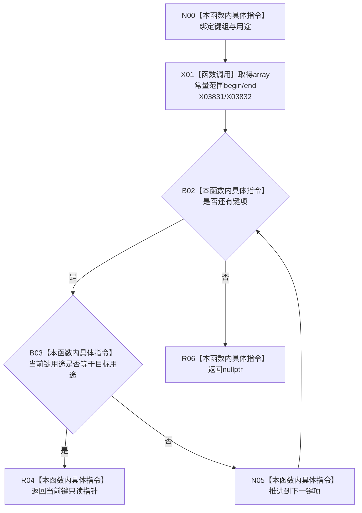

# CF-L8-0068 系统角色查找键现状流程图

图类型：现状流程图
代码版本：`3920a74638264f9f539d50f32f3c9fe5fb1982ab`
源码 blob：`b24322d4588808299a232bc308bebd463b7a87a0`
覆盖文件：`海中鱼巣/领域/数据操作.系统角色.ixx:222-227`
唯一根函数：R0412
完整签名：`static const 海中鱼巣::系统角色键占用材料* 海中鱼巣::系统角色数据操作::查找键(const std::array<海中鱼巣::系统角色键占用材料, 海中鱼巣::系统角色稳定键数量>& 键组, 海中鱼巣::系统角色稳定键用途 用途) noexcept`
参数：`键组` 为只读借用；`用途` 按值传入
返回结果：首次用途匹配项的只读指针；未找到返回 `nullptr`
已登记调用方：R0422（RCE1316，五个调用点）
直接项目函数：无
外部边界：X03831（`begin`）、X03832（`end`）
逐行映射表：`流程图/代码流程图/L8/CF-L8-0068_系统角色查找键_逐行代码映射表.md`
结构读取与写入：只遍历调用方键组，不修改数组或仓库
逻辑内返回：无匹配用途返回 `nullptr`
内部错误边界：无
依据提交 / 结构化消息：聚合关系基线 `7951b1bea78c7338643ab18428180d521e4d5a62`；冻结源码提交 `3920a74638264f9f539d50f32f3c9fe5fb1982ab`
验证输出：本批 Mermaid、节点双向、源码覆盖与差异格式检查
不得作为施工许可：是
不得宣称：返回非空指针表示对应节点已通过类型、主信息或关系读回

## 流程图

## 当前边界

- 返回指针只借用调用方数组元素，生命周期不超过 `键组`；本函数不分配或持有键项。
- X03831/X03832 分账范围 for 的 `std::array::begin/end`；指针比较、解引用和递增为语言级平凡操作。
