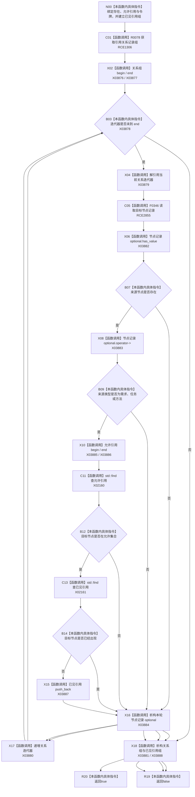

# CF-L8-0069 系统角色是允许的系统实际存在已许可现状流程图

图类型：现状流程图
代码版本：`3920a74638264f9f539d50f32f3c9fe5fb1982ab`
源码 blob：`b24322d4588808299a232bc308bebd463b7a87a0`
覆盖文件：`海中鱼巣/领域/数据操作.系统角色.ixx:355-372`
唯一根函数：R0420
完整签名：`bool 海中鱼巣::系统角色数据操作::是允许的系统实际存在_已许可(海中鱼巣::节点句柄 存在, const std::vector<海中鱼巣::节点句柄>& 允许引用, const 海中鱼巣::结构事务令牌& 令牌) const`
参数：`存在` 按值传入；`允许引用` 与 `令牌` 为调用方拥有的只读借用
返回结果：存在的需求/任务/方法引用全部属于允许集合且不重复时返回 true；来源节点缺失、出现未允许引用或重复引用时返回 false
已登记调用方：R0421（RCE1310）、R0422（RCE1317）
直接项目函数：R0078（RCE1306）、F0346（RCE2855）、F0051（RCE2856）
外部边界：X02160、X02161、X03876—X03888
逐行映射表：`流程图/代码流程图/L8/CF-L8-0069_系统角色是允许的系统实际存在已许可_逐行代码映射表.md`
结构读取与写入：只读引用关系与目标节点记录；`已见引用` 仅为函数内去重材料
逻辑内返回：未允许或重复的系统引用返回 false
内部错误边界：关系目标节点无法读回时返回 false，由上层按当前调用语境收口
依据提交 / 结构化消息：聚合关系基线 `7951b1bea78c7338643ab18428180d521e4d5a62`；冻结源码提交 `3920a74638264f9f539d50f32f3c9fe5fb1982ab`
验证输出：本批 Mermaid、节点双向、源码覆盖与差异格式检查
不得作为施工许可：是
不得宣称：返回 true 表示存在节点的全部关系或业务事实完整

## 流程图

## 当前边界

- RCE2855 固定第 361 行节点仓库带令牌读取；RCE2856 聚合两个节点句柄相等调用。
- X02160/X02161 是两个源码显式 `std::find`；其余范围迭代、optional 和 vector 生命周期均按单签名外部边界分账。
