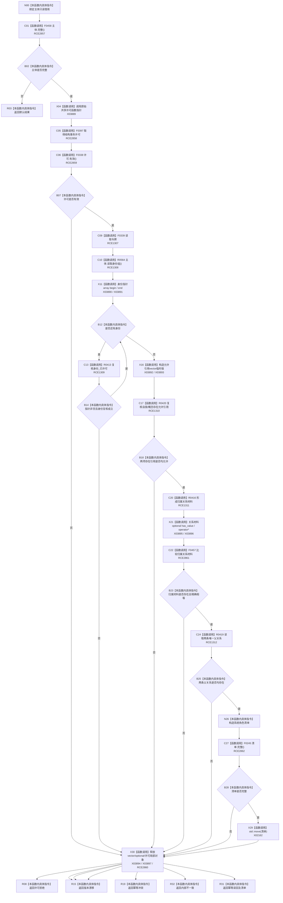

# CF-L8-0070 系统角色读取当前清单现状流程图

图类型：现状流程图
代码版本：`3920a74638264f9f539d50f32f3c9fe5fb1982ab`
源码 blob：`b24322d4588808299a232bc308bebd463b7a87a0`
覆盖文件：`海中鱼巣/领域/数据操作.系统角色.ixx:374-410`
唯一根函数：R0421
完整签名：`海中鱼巣::系统角色初始化结果 海中鱼巣::系统角色数据操作::读取当前清单(const 海中鱼巣::系统角色主体材料& 主体) const`
参数：`主体` 为调用方拥有的只读借用
返回结果：主体、身份、允许引用、归属和两条父子关系均精确读回且清单完整时返回幂等读回及清单；许可拒绝、幂等冲突、版本漂移或内部不一致返回相应状态
已登记调用方：R0409（RCE1285）、R0616（RCE1788）
直接项目函数：F0458（RCE2857）、F0397（RCE2858）、F0338（RCE2859）、F0345（RCE2860）、F0339（RCE1307）、R0564（RCE1308）、R0413（RCE1309）、R0420（RCE1310）、R0416（RCE1311）、F0457（RCE2861）、R0419（RCE1312）、F0245（RCE2862）
外部边界：X02162、X03889—X03897
逐行映射表：`流程图/代码流程图/L8/CF-L8-0070_系统角色读取当前清单_逐行代码映射表.md`
结构读取与写入：取得共享许可后只读节点、关系、主信息和索引，构造值式清单；不写机器结构
逻辑内返回：主体不完整、许可拒绝或当前结构不匹配时返回具名非成功结果
内部错误边界：全部结构读回成立但最终清单 `完整()` 为 false
依据提交 / 结构化消息：聚合关系基线 `7951b1bea78c7338643ab18428180d521e4d5a62`；冻结源码提交 `3920a74638264f9f539d50f32f3c9fe5fb1982ab`
验证输出：本批 Mermaid、节点双向、源码覆盖与差异格式检查
不得作为施工许可：是
不得宣称：幂等读回表示系统角色以外的世界事实或初始化全链完成

## 流程图

## 当前边界

- RCE2860 是许可局部对象从第 376 行构造至各返回路径的隐式析构边；它不表示提交或写入。
- 两个 `std::optional<系统角色关系材料>` 共享 X03895—X03897 单签名边界，出现次数在映射表中分账。
