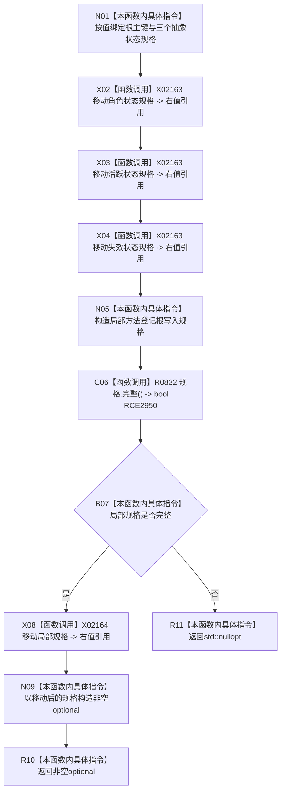

# CF-L8-0071 需求任务方法形成方法登记根写入规格现状流程图

图类型：现状流程图
代码版本：`3920a74638264f9f539d50f32f3c9fe5fb1982ab`
源码 blob：`16ac9534baeda26ac8a712066e713f3339f6e0c8`
覆盖文件：`海中鱼巣/领域/数据操作.需求任务方法.ixx:1022-1032`
唯一根函数：R0427
完整签名：`std::optional<方法登记根写入规格> 海中鱼巣::需求任务方法数据操作::形成方法登记根写入规格(std::uint64_t 根主键, 抽象状态写入规格 角色状态, 抽象状态写入规格 活跃状态, 抽象状态写入规格 失效状态) const`
参数：`根主键` 按值传入；三个抽象状态规格均按值传入并在构造局部规格时移动
返回结果：局部规格完整时移动构造并返回非空 optional，否则返回 `std::nullopt`
已登记调用方：R0499（RCE1502）
直接项目函数：R0832（RCE2950）
外部边界：X02163（同一行三次抽象状态规格移动）、X02164（方法登记根规格移动）
逐行映射表：`流程图/代码流程图/L8/CF-L8-0071_需求任务方法形成方法登记根写入规格_逐行代码映射表.md`
结构读取与写入：只构造局部值式写入规格和 optional 返回材料；不读取或写入仓库
逻辑内返回：规格完整性不成立时返回空 optional
内部错误边界：无
依据提交 / 结构化消息：当前维护基线 `7951b1bea78c7338643ab18428180d521e4d5a62`；冻结源码提交 `3920a74638264f9f539d50f32f3c9fe5fb1982ab`
不得作为施工许可：是
不得宣称：返回非空规格表示方法登记根或其状态、关系已经创建或发布

## 流程图

## 当前边界

- R0832 是源码第 692—695 行的 `方法登记根写入规格::完整()`，本批按直接闭包新增稳定身份。
- X02163 在第 1028 行调用三次同一 `std::move<抽象状态写入规格&>` 模板实例；X02164 只移动局部方法登记根规格。
- 本函数不创建方法节点、状态或关系，只形成后续写入口的值式规格。
