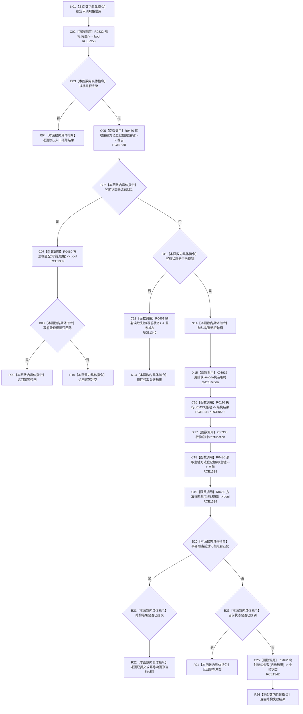

# CF-L8-0072 需求任务方法创建方法登记根现状流程图

图类型：现状流程图
代码版本：`3920a74638264f9f539d50f32f3c9fe5fb1982ab`
源码 blob：`16ac9534baeda26ac8a712066e713f3339f6e0c8`
覆盖文件：`海中鱼巣/领域/数据操作.需求任务方法.ixx:1619-1659`
唯一根函数：R0432
完整签名：`方法提交结果 海中鱼巣::需求任务方法数据操作::创建方法登记根(const 方法登记根写入规格& 规格) const`
参数：`规格` 为调用期只读借用；lambda 按引用捕获当前函数局部与成员
返回结果：规格拒绝、幂等读回/冲突、读取失败、已提交或结构失败的具名方法提交结果
已登记调用方：R0499（RCE1503）
直接项目函数：R0832（RCE2958）、R0430（RCE1338）、R0460（RCE1339）、R0461（RCE1340）、R0116（RCE1341）、R0462（RCE1342）
回调函数：R0433，由 R0116 经 RCE0562 调用
外部边界：X03937—X03938
逐行映射表：`流程图/代码流程图/L8/CF-L8-0072_需求任务方法创建方法登记根_逐行代码映射表.md`
结构读取与写入：写前和写后读取主键登记根；真正候选写入位于 R0433 并由 R0116 事务执行
逻辑内返回：规格拒绝、写前幂等读回/冲突和读取失败映射
内部错误边界：事务后读回不匹配且未形成可归类当前根时映射结构失败
依据提交 / 结构化消息：当前维护基线 `7951b1bea78c7338643ab18428180d521e4d5a62`；冻结源码提交 `3920a74638264f9f539d50f32f3c9fe5fb1982ab`
不得作为施工许可：是
不得宣称：返回已提交之外的结果表示结构已创建，或返回已提交证明整个方法能力完成

## 流程图

## 当前边界

- R0832 是规格完整性函数；R0432 与 R0427 共同构成其当前直接调用方。
- R0433 是非平凡事务回调；外层只通过 R0116 接收结构结果，不在本图展开回调内部节点。
- X03937/X03938 只承担临时 `std::function<void(结构写入会话&)>` 的构造与析构。
