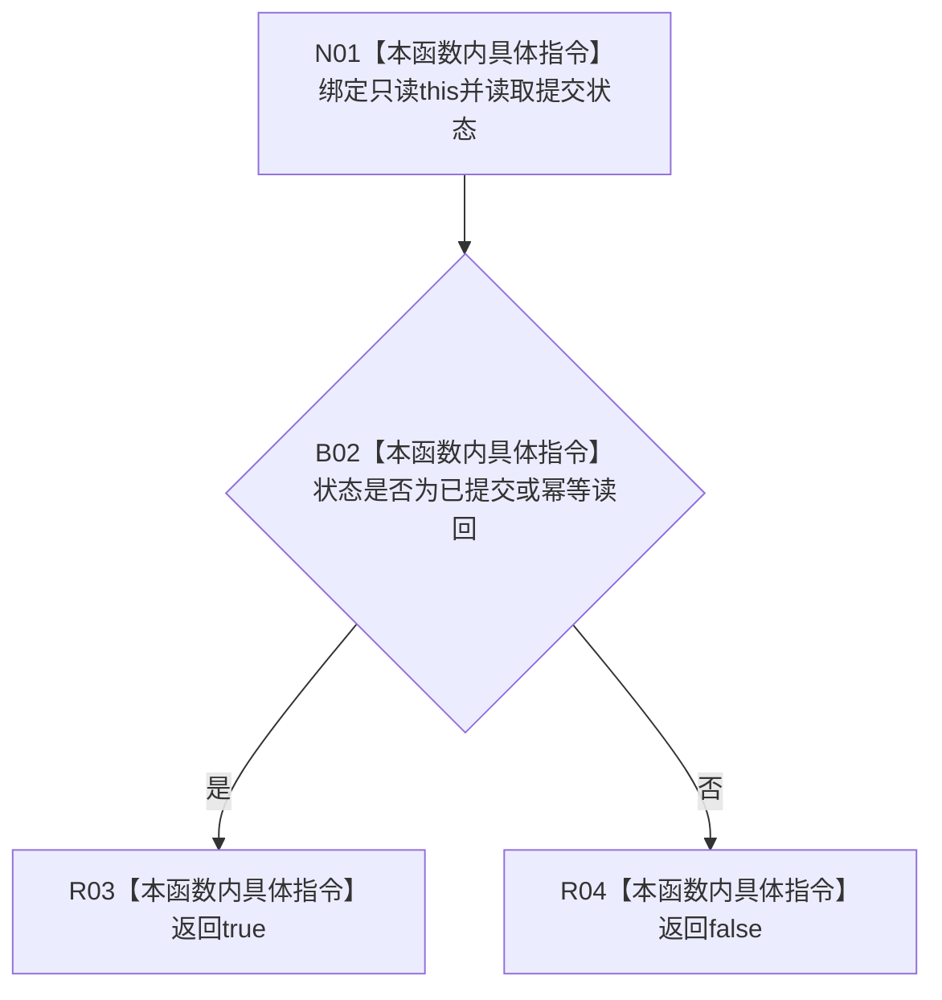

# CF-L8-0073 需求提交结果成功现状流程图

图类型：现状流程图
代码版本：`3920a74638264f9f539d50f32f3c9fe5fb1982ab`
源码 blob：`16ac9534baeda26ac8a712066e713f3339f6e0c8`
当前工作区复核基线：`af74e46ef3fd0b1b2c108d695569855909a59ee1`
覆盖文件：`海中鱼巣/领域/数据操作.需求任务方法.ixx:401-404`
唯一根函数：R0465
完整签名：`bool 海中鱼巣::需求提交结果::成功() const noexcept`
参数：无显式参数；隐式 `this` 为只读借用
返回结果：状态为 `已提交` 或 `幂等读回` 时返回 `true`，否则返回 `false`
已登记调用方：R0229（RCE0794）
直接项目函数：无
外部边界：无
逐行映射表：`流程图/代码流程图/L8/CF-L8-0073_需求提交结果成功_逐行代码映射表.md`
结构读写：只读取需求提交结果状态枚举
依据提交 / 结构化消息：当前维护基线 `57866ac5ca63235ed12da60f635d29f1aacd718b`；冻结源码提交 `3920a74638264f9f539d50f32f3c9fe5fb1982ab`
不得作为施工许可：是
不得宣称：返回 `true` 表示需求材料仍与仓库当前结构一致

## 流程图

## 当前边界

- 本函数不检查 `材料` 字段完整性，只判断结果状态枚举。
