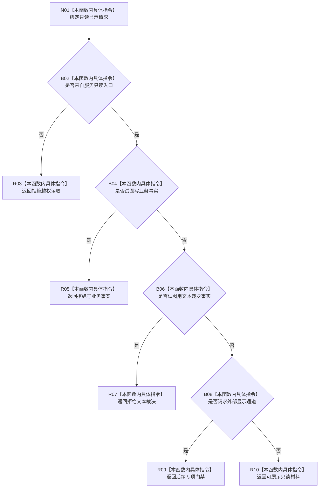

# CF-L8-0074 显示服务生成只读展示材料现状流程图

图类型：现状流程图
代码版本：`0a93526882cb33c61c2fbb04ecad1aeaddcfe225`
当前工作区复核基线：`ece29318f80cad2ce7a4abce9b009c60cd4cdfdd`
源码 blob：`95673f8d9ae4bfe5cbcd64e909b8e6ef00179782`
覆盖文件：`海中鱼巣/领域/显示服务.h:53-67`
唯一根函数：R0495
完整签名：`显示材料 海中鱼巣::显示服务::生成只读展示材料(const 显示请求& 请求) const`
参数：`请求` 为调用期只读借用；四个布尔字段只作展示边界判断
返回结果：越权、写事实、文本裁决、外部显示门禁或可展示状态；全部材料均保持人读且不允许写业务事实
已登记调用方：R0304（RCE0989）
直接项目函数：无
外部边界：无新增建议
逐行映射表：`流程图/代码流程图/L8/CF-L8-0074_显示服务生成只读展示材料_逐行代码映射表.md`
不得作为施工许可：是
不得宣称：已接入外部显示通道，或展示材料可以裁决或写入机器事实

## 流程图

## 关键边界

- 五条返回均把 `展示材料人读` 设为 true、`允许写业务事实` 设为 false。
- 外部显示请求只返回后续专项门禁，不在本函数接入控制面板、WebView 或外设。
