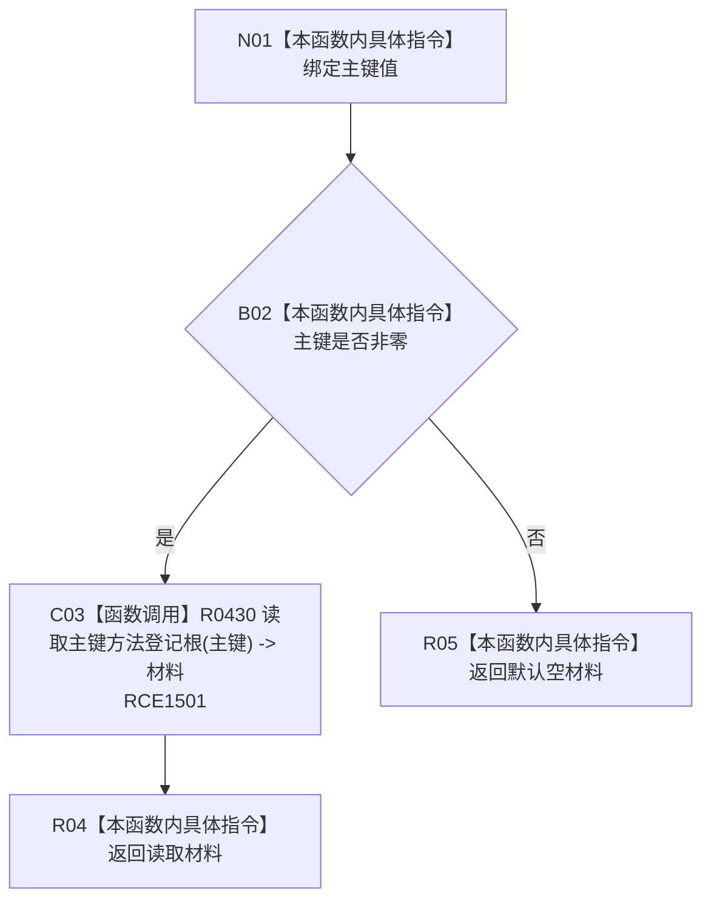

# CF-L8-0075 方法业务服务读取主键登记根现状流程图

图类型：现状流程图
代码版本：`0a93526882cb33c61c2fbb04ecad1aeaddcfe225`
当前工作区复核基线：`ece29318f80cad2ce7a4abce9b009c60cd4cdfdd`
源码 blob：`74a839fe2d983516ff7cb623d45464f8c7fdf5fb`
覆盖文件：`海中鱼巣/领域/服务.方法.ixx:213-215`
唯一根函数：R0497
完整签名：`方法登记根材料 海中鱼巣::方法业务服务::读取主键登记根(std::uint64_t 主键) const`
参数：`主键` 值传入；零值为入口无效
返回结果：零主键返回默认空材料；非零主键原样返回 R0430 的登记根材料
已登记调用方：R0234（RCE0808）、R0236（RCE0813）
直接项目函数：R0430（RCE1501）
外部边界：无新增建议
逐行映射表：`流程图/代码流程图/L8/CF-L8-0075_方法业务服务读取主键登记根_逐行代码映射表.md`
不得作为施工许可：是
不得宣称：返回材料完整，或登记根已经按目标业务规则创建

## 流程图

## 关键边界

- 本函数仅增加零主键门禁，零结构写入。
- R0430 的索引读取、类型匹配和材料完整性由其独立现状图承载。
