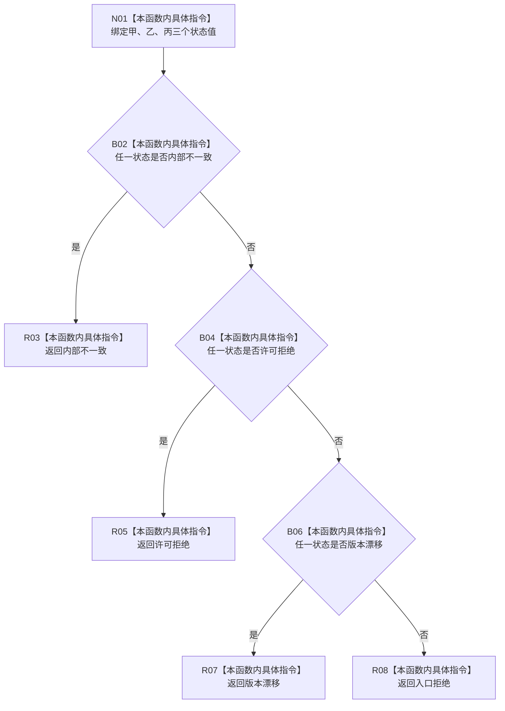

# CF-L8-0076 方法业务服务合并状态规格失败现状流程图

图类型：现状流程图
代码版本：`0a93526882cb33c61c2fbb04ecad1aeaddcfe225`
当前工作区复核基线：`ece29318f80cad2ce7a4abce9b009c60cd4cdfdd`
源码 blob：`74a839fe2d983516ff7cb623d45464f8c7fdf5fb`
覆盖文件：`海中鱼巣/领域/服务.方法.ixx:278-298`
唯一根函数：R0498
完整签名：`static 需求任务方法业务状态 海中鱼巣::方法业务服务::合并状态规格失败(状态写入规格状态 甲, 状态写入规格状态 乙, 状态写入规格状态 丙) noexcept`
参数：三个状态枚举均值传入，无所有权转移
返回结果：按内部不一致、许可拒绝、版本漂移的优先级映射；均未命中时返回入口拒绝
已登记调用方：R0499（RCE1504）
直接项目函数：无
外部边界：无新增建议
逐行映射表：`流程图/代码流程图/L8/CF-L8-0076_方法业务服务合并状态规格失败_逐行代码映射表.md`
不得作为施工许可：是
不得宣称：输入状态已经覆盖所有目标错误语义，或当前优先级已通过运行验证

## 流程图

## 关键边界

- 本函数是纯枚举合并，不读取或写入任何机器结构。
- 优先级固定为内部不一致高于许可拒绝，高于版本漂移，高于入口拒绝。
