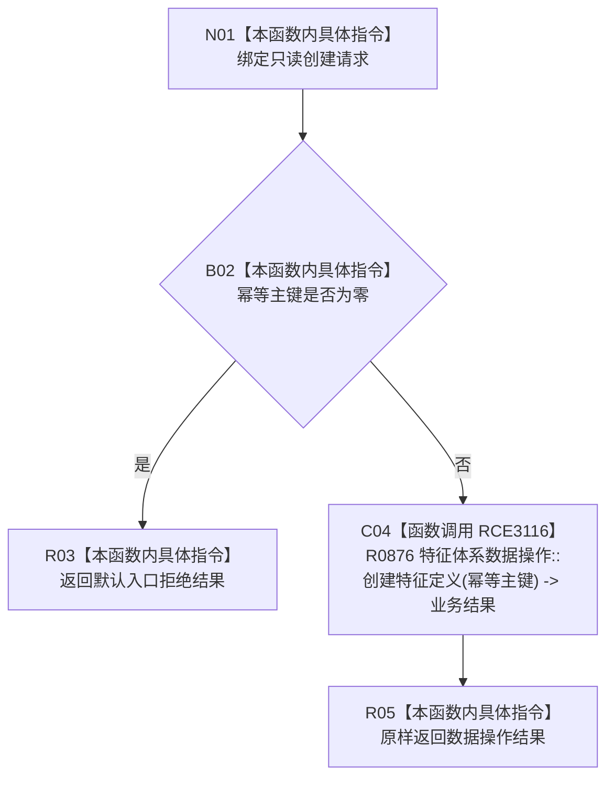

# CF-L8-0077 特征业务服务创建特征定义现状流程图

图类型：现状流程图
代码版本：`0a93526882cb33c61c2fbb04ecad1aeaddcfe225`
当前工作区复核基线：`ece29318f80cad2ce7a4abce9b009c60cd4cdfdd`
源码 blob：`7620a4c6316130cd8af546d69b9528fc696db5c3`
覆盖文件：`海中鱼巣/领域/服务.特征.ixx:111-114`
唯一根函数：R0501
完整签名：`海中鱼巣::特征体系业务结果 海中鱼巣::特征业务服务::创建特征定义(const 海中鱼巣::创建特征定义请求& 请求) const`
参数：`请求` 为调用期只读借用；读取 `幂等主键`
返回结果：零主键返回默认入口拒绝；非零主键原样返回数据操作的特征体系业务结果
已登记调用方：R0229（RCE0787）
直接项目函数：R0876 `特征体系业务结果 海中鱼巣::特征体系数据操作::创建特征定义(std::uint64_t 主键) const`（RCE3116）
外部边界：无
逐行映射表：`流程图/代码流程图/L8/CF-L8-0077_特征业务服务创建特征定义_逐行代码映射表.md`
不得作为施工许可：是
不得宣称：非零主键必然创建新定义，或特征体系业务已经整体完成

## 流程图

## 关键边界

- 本函数只执行零主键门禁；幂等、冲突、事务和读回由数据操作被调函数承载。
- 被调函数 R0876 定义位于 `海中鱼巣/领域/数据操作.特征体系.ixx:691-719`；其内部闭包另由正式调用关系表递归登记。
