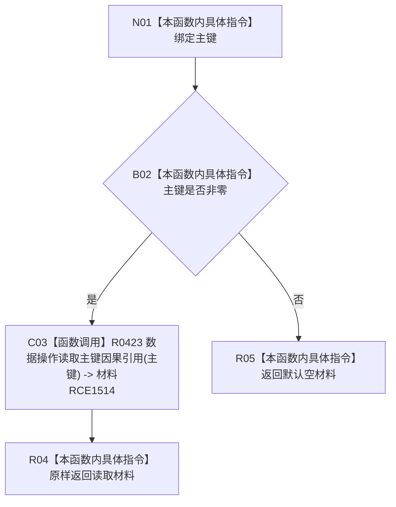

# CF-L8-0078 轻量因果业务服务读取主键轻量因果现状流程图

图类型：现状流程图
代码版本：`0a93526882cb33c61c2fbb04ecad1aeaddcfe225`
当前工作区复核基线：`c3939fcd2fe13b6a5ba69e5dcad6efc519bdf667`
源码 blob：`212fc1b447164eeebf24fd927f240476a2805699`
覆盖文件：`海中鱼巣/领域/服务.轻量因果.ixx:50-54`
唯一根函数：R0512
完整签名：`轻量因果值式材料 海中鱼巣::轻量因果业务服务::读取主键轻量因果(std::uint64_t 主键) const`
参数：主键值传入；零值为无效入口
返回结果：主键非零时原样返回 R0423 的读取材料；主键为零时返回默认空材料
已登记调用方：R0232、R0236
直接项目函数：R0423（RCE1514）
逐行映射表：`流程图/代码流程图/L8/CF-L8-0078_轻量因果业务服务读取主键轻量因果_逐行代码映射表.md`
不得作为施工许可：是
不得宣称：返回材料必然已找到或完整

## 流程图

## 关键边界

- 本函数零结构写入；读取状态和材料完整性由 R0423 的独立函数事实承载。
