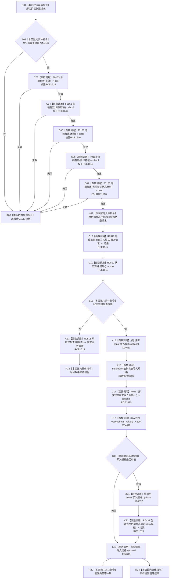

# CF-L8-0079 需求业务服务创建完整目标状态需求现状流程图

图类型：现状流程图
代码版本：`0a93526882cb33c61c2fbb04ecad1aeaddcfe225`
当前工作区复核基线：`c3939fcd2fe13b6a5ba69e5dcad6efc519bdf667`
源码 blob：`c56f9fc6c725e59a2d57cd5557326c5887384b4f`
覆盖文件：`海中鱼巣/领域/服务.需求.ixx:88-106`
唯一根函数：R0514
完整签名：`海中鱼巣::需求提交结果 海中鱼巣::需求业务服务::创建完整目标状态需求(const 海中鱼巣::创建完整目标状态需求请求& 请求) const`
参数：`请求` 为调用期只读借用
返回结果：入口拒绝、规格失败映射、内部不一致，或 R0431 返回的完整目标状态需求创建结果
已登记调用方：R0229（RCE0792）
直接项目函数：F0163、R0511、R0510、R0513、R0467、R0431
外部边界：X02189；状态规格解引用为 X04610，写入规格 optional 查询/解引用/析构为 X04611—X04613
逐行映射表：`流程图/代码流程图/L8/CF-L8-0079_需求业务服务创建完整目标状态需求_逐行代码映射表.md`
不得作为施工许可：是
不得宣称：规格形成或调用返回等于需求业务闭环已经验收

## 流程图

## 关键边界

- 五次句柄校验均绑定节点句柄重载 F0163；RCE1516 当前被调身份需校正。
- R0467 只在状态规格成功后调用；R0431 只在完整需求写入规格有值后调用。
