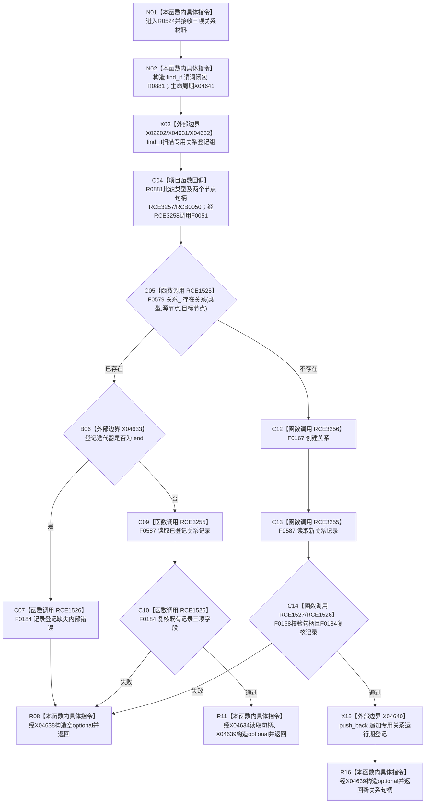

# CF-L8-0080 概念图服务确保专用关系已加锁现状流程图

图类型：现状流程图
代码版本：`0a93526882cb33c61c2fbb04ecad1aeaddcfe225`
工作区复核基线：`c3939fcd2fe13b6a5ba69e5dcad6efc519bdf667`
源码 blob：`dc4bd08f99622b3380c91dd15258fc8ab2e1b9c6`
覆盖文件：`海中鱼巣/领域/概念图服务.h:3932-3968`
唯一根函数：R0524
完整签名：`std::optional<海中鱼巣::关系句柄> 海中鱼巣::概念图服务::确保专用关系_已加锁(海中鱼巣::关系类型 类型, 海中鱼巣::节点句柄 源节点, 海中鱼巣::节点句柄 目标节点)`
参数：关系类型和两个节点句柄按值；调用方负责已经持有本服务所需写锁
返回结果：既有关系及登记读回一致时返回其句柄；不存在时创建、读回、登记并返回新句柄；内部不一致返回空 optional
已登记调用方：R0526（RCE1531）
已登记直接项目函数：F0579（RCE1525）、F0184（RCE1526）、F0168（RCE1527）
项目闭包：R0881 及 RCE3255—RCE3258；find_if 回调登记 RCB0050
外部边界：X02202、X04631—X04640；R0881 生命周期为 X04641
逐行映射表：`流程图/代码流程图/L8/CF-L8-0080_概念图服务确保专用关系已加锁_逐行代码映射表.md`
结构读写：读取关系仓与运行期登记；缺失时创建关系并追加运行期登记
不得作为施工许可：是
不得宣称：返回有值代表事务、活动快照发布或完整业务关系闭环已经完成

## 流程图

## 当前边界

- `已加锁` 是函数名和调用合同的一部分；函数内部不再次取得服务锁。
- 已有关系但运行期登记缺失、或任一读回不一致，均通过 F0184 记录内部错误并返回空值。
- 新建分支先写关系仓，读回通过后才追加 `专用关系登记组_`；读回失败时当前函数不撤销已经创建的关系。
