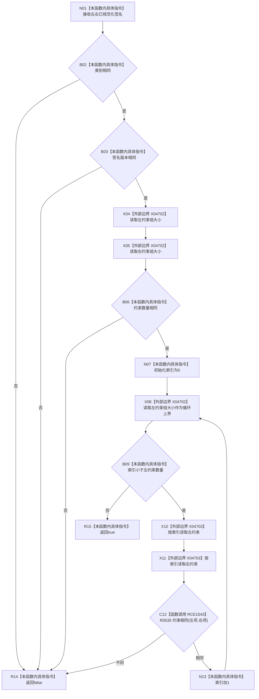

# CF-L8-0081 概念图算法签名相同现状流程图

图类型：现状流程图
代码版本：`0a93526882cb33c61c2fbb04ecad1aeaddcfe225`
工作区复核基线：`2089268fbb3833ebc77486169b98d8a14c49d508`
源码 blob：`31c9794099a8fc191c3d5d9369010c52cd863039`
覆盖文件：`海中鱼巣/领域/概念图算法.h:670-682`
唯一根函数：R0536
完整签名：`static bool 海中鱼巣::概念图算法::签名相同(const 概念签名材料& 左, const 概念签名材料& 右)`
参数：左、右均为 `const 概念签名材料&`，只读借用；调用语境要求两份签名已规范化
返回结果：类别、签名版本、约束数量和各索引约束均相同时返回 `true`，否则返回 `false`
已登记调用方：R0537（RCE1544）
直接项目函数：R0535（RCE1543）
外部边界：X04702（vector `size()`）、X04703（vector `operator[]`）
逐行映射表：`流程图/代码流程图/L8/CF-L8-0081_概念图算法签名相同_逐行代码映射表.md`
结构读写：只读两份签名字段和约束组
不得作为施工许可：是
不得宣称：签名相同代表对应概念节点或活动图结构相同

## 流程图

## 当前边界

- 约束数量相等前不会下标读取；循环上界取左约束组大小。
- 本函数假定约束顺序已有意义，不在本函数内重新排序或规范化。
